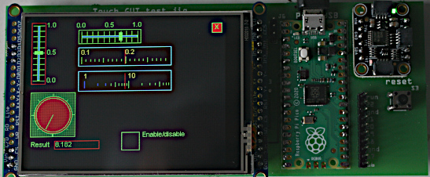
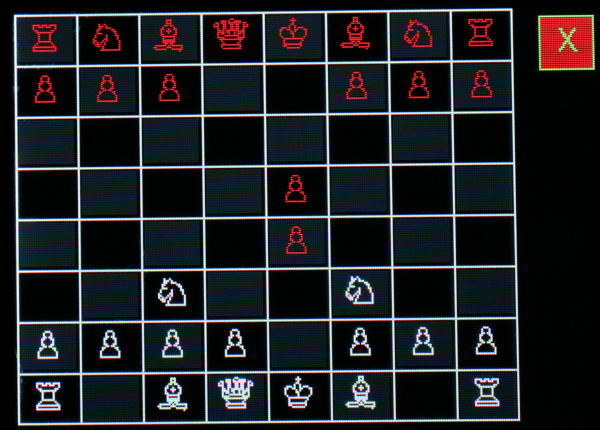
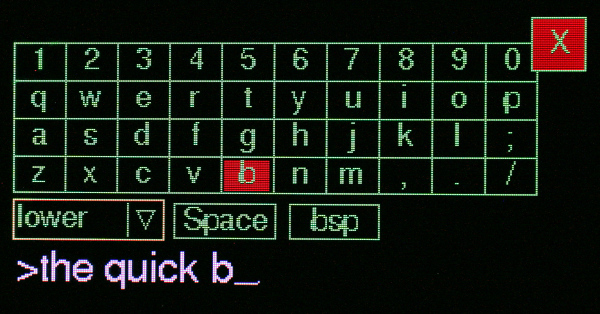
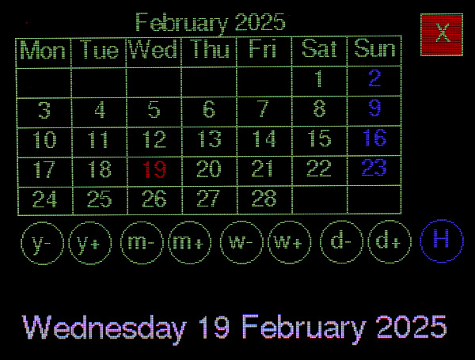

# micropython-touch

This is a lightweight, portable, MicroPython GUI library for displays having
a touch interface and with drivers subclassed from
[framebuf](https://docs.micropython.org/en/latest/library/framebuf.html).
Written in Python it runs under a standard MicroPython firmware build. Input is
by touch. The design is intended to support a range of touch controllers.
Currently the TSC2007, XPT2046, CST816S, CST820 and FT6206 are supported.

It is larger and more complex than
[nano-gui](https://github.com/peterhinch/micropython-nano-gui) owing to its
support for input. The GUI enables switching between screens and launching modal
windows. Widgets are a substantial superset of `nano-gui` widgets. It is
compatible with all `nano-gui` display drivers so is portable to a wide range of
displays. Support for e-paper is theoretically possible if any exist with touch
controllers. The GUI is also portable between hosts.

It was developed from [micro-gui](https://github.com/peterhinch/micropython-micro-gui/tree/main)
with the aim of supporting a variety of touch controllers. Touch drivers share
a common API via a common abstract base class, the aim being to simplify the
design of touch controller drivers.

  
Raspberry Pico with an ILI9341 from eBay (XPT2046 touch controller).

  
Raspberry Pico with Adafruit 3.2" display and TSC2007 touch controller.

  
Chess game.

  
Keyboard demo.

  
Calendar demo - a perpetual calendar.

# Documents

[Supported displays](https://github.com/peterhinch/micropython-nano-gui/blob/master/DISPLAYS.md).  
[Setup guide](./SETUP.md) Quick start guide. Calibration and approaches to application development.  
[Touchpad drivers](./TOUCHPAD.md) Details of supported drivers and technical notes.  
Commercial links to hardware that produced excellent results:  
[TSC2007 breakout](http://www.adafruit.com/products/5423) Interface to displays
that bring out analog touch signals, such as  
[Adafruit 3.2" touchscreen](https://www.adafruit.com/product/1743)  
Waveshare make touch displays where the Raspberry Pico plugs in e.g.
[Waveshare Pico res touch](https://www.waveshare.com/wiki/Pico-ResTouch-LCD-2.8).  

# Alternative GUIs for MicroPython

The following are similar GUI repos with differing objectives.
 * [nano-gui](https://github.com/peterhinch/micropython-nano-gui) Extremely low
 RAM usage but display-only with no provision for input.
 * [micro-gui](https://github.com/peterhinch/micropython-micro-gui/tree/main) A
 similar GUI with input provided by various configurations of pushbuttons and/or
 an encoder. Ideal for displays lacking touch overlays.
  * [RA8875](https://github.com/peterhinch/micropython_ra8875) Touch GUI for
 displays with RA8875 controller. Supports large displays, e.g. from Adafruit.
 * [SSD1963](https://github.com/peterhinch/micropython-tft-gui) Touch GUI for
 displays based on SSD1963 and XPT2046. High performance on large displays due
 to the parallel interface. Specific to STM hosts.
 * [LCD160cr](https://github.com/peterhinch/micropython-lcd160cr-gui) Touch GUI
 for the official display. Alas the hardware is hewn from ingots of the purest,
 weapons grade unobtanium.

[LVGL](https://lvgl.io/) is a pretty icon-based GUI library. It is written in C
with MicroPython bindings; consequently it requires the build system for your
target and a C device driver (unless you can acquire a suitable binary).

# Project status

Dec 2025: Usability improvements to Listbox, Dropdown and Menu widgets.
Dec 2024: hardware_setup.py now renamed touch_setup.py (existing users please note).  
Oct 2024: Refresh locking can now be handled by device driver.  
Sept 2024: Dropdown and Listbox widgets support dynamically variable lists of elements.  
May 2024: Add support for round displays with CST816S touch controller.  
April 2024: Touch ABC simplified and bugs fixed. Demos updated to take advantage
of larger displays.  
March 2024: Port from micro-gui.

# Before you start

Please read [the quick start guide](./SETUP.md) which advises on hardware selection
and configuration.

# 0. Contents

1. [Basic concepts](./README.md#1-basic-concepts) Including "Hello world" script.  
 1.1 [Coordinates](./README.md#11-coordinates) The GUI's coordinate system.  
 1.2 [Screen Window and Widget objects](./README.md#12-Screen-window-and-widget-objects) Basic GUI classes.  
 1.3 [Fonts](./README.md#13-fonts)  
 1.4 [Widget control](./README.md#14-widget-control) Operation of variable controls.  
 1.5 [Hardware definition](./README.md#15-hardware-definition) How to configure your hardware.  
 1.6 [Quick start](./README.md#16-quick-start) Also a guide to hardware choice, calibration, application development.   
 1.7 [Files](./README.md#17-files) Discussion of the files in the library.  
 &nbsp;&nbsp;&nbsp;&nbsp;&nbsp;1.7.1 [Demos](./README.md#171-demos) Simple demos showing coding techniques.  
 &nbsp;&nbsp;&nbsp;&nbsp;&nbsp;1.7.2 [Test scripts](./README.md#172-test-scripts) GUI tests, some needing larger displays  
 1.8 [Floating Point Widgets](./README.md#18-floating-point-widgets) How to input floating point data.  
2. [Usage](./README.md#2-usage) Application design.  
 2.1 [Program structure and operation](./README.md#21-program-structure-and-operation) A simple demo of navigation and use.  
 2.2 [Callbacks](./README.md#22-callbacks)  
 2.3 [Colors](./README.md#23-colors)  
 &nbsp;&nbsp;&nbsp;&nbsp;&nbsp;2.3.1 [Monochrome displays](./README.md#231-monochrome-displays)  
3. [The ssd and display objects](./README.md#3-the-ssd-and-display-objects)  
 3.1 [SSD class](./README.md#31-ssd-class) Instantiation in touch_setup.  
 3.2 [Display class](./README.md#32-display-class) Instantiation in touch_setup.py.  
4. [Screen class](./README.md#4-screen-class) Full screen window.  
 4.1 [Class methods](./README.md#41-class-methods)  
 4.2 [Constructor](./README.md#42-constructor)  
 4.3 [Callback methods](./README.md#43-callback-methods) Methods which run in response to events.  
 4.4 [Method](./README.md#44-method) Optional interface to asyncio code.  
 4.5 [Class variable](./README.md#45-class-variable) Control latency caused by garbage collection.  
 4.6 [Retrieving data](./README.md#46-retrieving-data) Accessing data created in a screen.  
5. [Window class](./README.md#5-window-class)  
 5.1 [Constructor](./README.md#51-constructor)  
 5.2 [Class method](./README.md#52-class-method)  
 5.3 [Popup windows](./README.md#53-popup-windows)  
6. [Widgets](./README.md#6-widgets) Displayable objects.  
 6.1 [Label widget](./README.md#61-label-widget) Single line text display.  
 &nbsp;&nbsp;&nbsp;&nbsp;&nbsp;6.1.1 [Grid widget](./README.md#611-grid-widget) A spreadsheet-like array of labels.  
 6.2 [LED widget](./README.md#62-led-widget) Display Boolean values.  
 6.3 [Checkbox widget](./README.md#63-checkbox-widget) Enter Boolean values.  
 6.4 [Button and CloseButton widgets](./README.md#64-button-and-closebutton-widgets) Pushbutton emulation.  
 6.5 [ButtonList object](./README.md#65-buttonlist-object) Pushbuttons with multiple states.  
 6.6 [RadioButtons object](./README.md#66-radiobuttons-object) One-of-N pushbuttons.  
 6.7 [Listbox widget](./README.md#67-listbox-widget)  
 &nbsp;&nbsp;&nbsp;&nbsp;&nbsp;6.7.1 [Dynamic changes](./README.md#671-dynamic-changes) Alter listbox contents at runtime.  
 6.8 [Dropdown widget](./README.md#68-dropdown-widget) Dropdown lists.  
 &nbsp;&nbsp;&nbsp;&nbsp;&nbsp;6.8.1 [Dynamic changes](./README.md#681-dynamic-changes) Alter dropdown contents at runtime.  
 6.9 [DialogBox class](./README.md#69-dialogbox-class) Pop-up modal dialog boxes.  
 6.10 [Textbox widget](./README.md#610-textbox-widget) Scrolling text display.  
 6.11 [Meter widget](./README.md#611-meter-widget) Display floats on an analog meter, with data driven callbacks.  
 &nbsp;&nbsp;&nbsp;&nbsp;&nbsp;6.11.1 [Region class](./README.md#6111-region-class) Convert a Meter to a thermostat type object.  
 6.12 [Slider and HorizSlider widgets](./README.md#612-slider-and-horizslider-widgets) Linear potentiometer float data entry and display  
 6.13 [Scale widget](./README.md#613-scale-widget) High precision float entry and display.  
 6.14 [ScaleLog widget](./README.md#614-scalelog-widget) Wide dynamic range float entry and display.  
 6.15 [Dial widget](./README.md#615-dial-widget) Display multiple vectors.  
 6.16 [Knob widget](./README.md#616-knob-widget) Rotary potentiometer float entry.  
 6.17 [Menu class](./README.md#617-menu-class)  
 6.18 [BitMap widget](./README.md#618-bitmap-widget) Draw bitmaps from files.  
 6.19 [QRMap widget](./README.md#619-qrmap-widget) Draw QR codes created by uQR.  
 6.20 [Pad widget](./README.md#620-pad-widget) Invisible region sensitive to touch.
7. [Graph plotting](./README.md#7-graph-plotting) Widgets for Cartesian and polar graphs.  
 7.1 [Concepts](./README.md#71-concepts)  
 &nbsp;&nbsp;&nbsp;&nbsp;&nbsp;7.1.1 [Graph classes](./README.md#711-graph-classes)  
 &nbsp;&nbsp;&nbsp;&nbsp;&nbsp;7.1.2 [Curve classes](./README.md#712-curve-classes)  
 &nbsp;&nbsp;&nbsp;&nbsp;&nbsp;7.1.3 [Coordinates](./README.md#713-coordinates)  
 7.2 [Graph classes](./README.md#72-graph-classes)  
 &nbsp;&nbsp;&nbsp;&nbsp;&nbsp;7.2.1 [Class CartesianGraph](./README.md#721-class-cartesiangraph)  
 &nbsp;&nbsp;&nbsp;&nbsp;&nbsp;7.2.2 [Class PolarGraph](./README.md#722-class-polargraph)  
 7.3 [Curve classes](./README.md#73-curve-classes)  
 &nbsp;&nbsp;&nbsp;&nbsp;&nbsp;7.3.1 [Class Curve](./README.md#731-class-curve)  
 &nbsp;&nbsp;&nbsp;&nbsp;&nbsp;7.3.2 [Class PolarCurve](./README.md#732-class-polarcurve)  
 7.4 [Class TSequence](./README.md#74-class-tsequence) Plotting realtime, time sequential data.  
8. [Realtime applications](./README.md#8-realtime-applications) Accommodating tasks requiring fast RT performance: refresh control.  

[Appendix 1 Application design](./README.md#appendix-1-application-design) Useful hints.  
[Appendix 2 Freezing bytecode](./README.md#appendix-2-freezing-bytecode) Optional way to save RAM.  
[Appendix 3 Cross compiling](./README.md#appendix-3-cross-compiling) Another way to save RAM.  
[Appendix 4 GUI Design notes](./README.md#appendix-4-gui-design-notes) The reason for continuous refresh.  
[Appendix 5 Bus sharing](./README.md#appendix-5-bus-sharing) Using the SD card on Waveshare boards.    

# 1. Basic concepts

Internally `micropython-touch` uses `asyncio`. The interface is callback-based;
knowledge of `asyncio` is not required for its use. Display refresh is handled
automatically. Widgets are drawn using graphics primitives rather than icons.
This makes them efficiently scalable and minimises RAM usage compared to
icon-based graphics. It also facilitates the provision of extra visual
information. For example the color of all or part of a widget may be changed
programmatically, for example to highlight an overrange condition. There is
limited support for
[icons](https://github.com/peterhinch/micropython-font-to-py/blob/master/writer/WRITER.md#3-icons)
in pushbuttons via icon fonts, also via the [BitMap widget](./README.md#619-bitmap-widget).

The following, taken from `gui.demos.simple.py`, is a complete application. It
shows a message and has "Yes" and "No" buttons which trigger a callback.
```python
import touch_setup  # Create a display instance linked to touch controller
from gui.core.tgui import Screen, ssd

from gui.widgets import Label, Button, CloseButton
# from gui.core.writer import Writer  # Monochrome display
from gui.core.writer import CWriter
# Font for CWriter or Writer
import gui.fonts.arial10 as arial10
from gui.core.colors import *


class BaseScreen(Screen):

    def __init__(self):

        def my_callback(button, arg):
            print('Button pressed', arg)

        super().__init__()
        # wri = Writer(ssd, arial10, verbose=False)  # Monochrome display
        wri = CWriter(ssd, arial10, GREEN, BLACK, verbose=False)

        col = 2
        row = 2
        Label(wri, row, col, 'Simple Demo')
        row = 50
        Button(wri, row, col, text='Yes', callback=my_callback, args=('Yes',))
        col += 60
        Button(wri, row, col, text='No', callback=my_callback, args=('No',))
        CloseButton(wri)  # Quit the application

def test():
    print('Simple demo: button presses print to REPL.')
    Screen.change(BaseScreen)  # A class is passed here, not an instance.

test()
```
Notes:  
 * Monochrome displays use the `Writer` class rather than `CWriter` to
 render fonts, as per the commented-out code above.
 * Hardware is defined by a single small file `touch_setup.py` which the
 user must edit.

## 1.1 Coordinates

These are defined as `row` and `col` values where `row==0` and `col==0`
corresponds to the top left most pixel. Rows increase downwards and columns
increase to the right. The graph plotting widget uses normal mathematical
conventions within graphs.

###### [Contents](./README.md#0-contents)

## 1.2 Screen Window and Widget objects

A `Screen` is a window which occupies the entire display. A `Screen` can
overlay another, replacing all its contents. When closed, the `Screen` below is
re-displayed. This default method of navigation results in a tree structure of
`Screen` instances where the screen below retains state. An alternative allows
a `Screen` to replace another, allowing `Screen` instances to be navigated in an
arbitrary way. For example a set of `Screen` instances might be navigated in a
circular fashion. The penalty is that, to save RAM, state is not retained when a
`Screen` is replaced

A `Window` is a subclass of `Screen` but is smaller, having size and location
attributes. It can overlay part of an underlying `Screen` and is typically used
for dialog boxes. `Window` objects are modal: a `Window` can overlay a `Screen`
but cannot overlay another `Window`.

A `Widget` is an object capable of displaying data. Some are also capable of
data input: such a widget is defined as `active`. A `passive` widget can only
display data. An `active` widget can respond to touch. `Widget` objects have
dimensions defined by bound variables `height` and `width`.

###### [Contents](./README.md#0-contents)

## 1.3 Fonts

Python font files are in the `gui/fonts` directory. The easiest way to conserve
RAM is to freeze them which is highly recommended. In doing so the directory
structure must be maintained.

To create alternatives, Python fonts may be generated from industry standard
font files with
[font_to_py.py](https://github.com/peterhinch/micropython-font-to-py.git). The
`-x` option for horizontal mapping must be specified. If fixed pitch rendering
is required `-f` is also required. Supplied examples are:

 * `arial10.py` Variable pitch Arial. 10 pixels high.
 * `arial35.py` Arial 35 high.
 * `arial_50.py` Arial 50 high.
 * `courier20.py` Fixed pitch Courier, 20 high.
 * `font6.py` FreeSans 14 high.
 * `font10.py` FreeSans 17 high.
 * `freesans20.py` FreeSans 20 high.

###### [Contents](./README.md#0-contents)

## 1.4 Widget control

Some widgets support the entry of floating point values, for example slider
controls. These operate as follows. A touch near one end of the control causes
the value to increase, touching near the other end causes it to decrease. The
rate of change depends on the distance between the touch and the widget centre.
This enables rapid change, but also slow and extremely precise adjustment.

###### [Contents](./README.md#0-contents)

## 1.5 Hardware definition

A file `touch_setup.py` must exist in the GUI root directory. This defines
the connections to the display and the display driver. It also defines the touch
driver and the pins used for its interface. The doc referenced in the next
section describes the creation of a `touch_setup.py` in detail. Example files
may be found in the `setup_examples` directory. Further examples (without touch
controller definitions) are in this
[nano-gui directory](https://github.com/peterhinch/micropython-nano-gui/tree/master/setup_examples).

The following is a typical example for a Raspberry Pi Pico driving an ILI9341
display with TSC2007 touch controller:
```python
from machine import Pin, SoftI2C, SPI, freq
import gc
from drivers.ili93xx.ili9341 import ILI9341 as SSD

freq(250_000_000)  # RP2 overclock
# Create and export an SSD instance
prst = Pin(8, Pin.OUT, value=1)
pdc = Pin(9, Pin.OUT, value=0)  # Arbitrary pins
pcs = Pin(10, Pin.OUT, value=1)
spi = SPI(0, sck=Pin(6), mosi=Pin(7), miso=Pin(4), baudrate=30_000_000)
gc.collect()  # Precaution before instantiating framebuf
ssd = SSD(spi, pcs, pdc, prst, height=240, width=320, usd=True)  # 240x320 default
from gui.core.tgui import Display

# Touch configuration
from touch.tsc2007 import TSC2007
i2c = SoftI2C(scl=Pin(27), sda=Pin(26), freq=100_000)
tpad = TSC2007(i2c)
# The following line of code is the outcome of calibration.
tpad.init(240, 320, 241, 292, 3866, 3887, True, True, False)
display = Display(ssd, tpad)
```
###### [Contents](./README.md#0-contents)

## 1.6 Quick start

Please ensure device firmware is up to date. [SETUP.md](./SETUP.md) describes
how to configure, calibrate and test a touchscreen so that the demos below may
be run. It includes ideas on application development.

###### [Contents](./README.md#0-contents)

## 1.7 Files

Display drivers may be found in the `drivers` directory. These are copies of
those in `nano-gui`, included for convenience. Note the file
`drivers/boolpalette.py`, required by all color drivers.

The system is organised as a Python package with the root being `gui`. Core
files in `gui/core` are:  
 * `colors.py` Constants including colors and shapes.
 * `tgui.py` The main GUI code.
 * `writer.py` Supports the `Writer` and `CWriter` classes.  

Touch support is in the `touch` directory:
* `touch.py` Common abstract base class.
* `tsc2007.py` Driver for TSC2007 controller.
* `xpt2046.py` Driver for XPT2046 controller.
* `ft6206.py` FT6206 capacitive screen controller.
Other drivers will be added.

The `gui/demos` directory contains a variety of demos and tests described
below.

### 1.7.1 Demos

Demos are run from the GUI root directory by issuing (for example):
```python
>>> import gui.demos.simple
```
If shut down cleanly with the "close" button a demo can be re-run with (e.g.):
```python
gui.demos.simple.test()
```
Before running a different demo the host should be reset (ctrl-d) to clear RAM.

It is possible to run the demos without installing. Copy the directory tree to
the PC with
```bash
$ git clone https://github.com/peterhinch/micropython-touch
```
 Ensure your `touch setup.py` is in the GUI root and the hardware is connected.
 Then issue (e.g.)
```bash
$ mpremote mount . exec "import gui.demos.simple"
```

The initial demos are minimal and aim to demonstrate a single technique.  
 * `simple.py` Minimal demo discussed below. `Button` presses print to REPL.
 * `checkbox.py` A `Checkbox` controlling an `LED`.
 * `slider.py` A `Slider` whose color varies with its value.
 * `slider_label.py` A `Slider` updating a `Label`.
 * `linked_sliders.py` One `Slider` updating two others, and a coding "wrinkle"
 required for doing this.
 * `dropdown.py` A dropdown list (with scrolling) updates a `Label`.
 * `listbox.py` A listbox with scrolling.
 * `dialog.py` `DialogBox` demo. Illustrates the screen change mechanism.
 * `screen_change.py` A `Button` causing a screen change using a re-usable
 "forward" button.
 * `screen_replace.py` A more complex (non-tree) screen layout.
 * `primitives.py` Use of graphics primitives, also the `Pad` widget.
 * `aclock.py` An analog clock using the `Dial` vector display. Also shows
 screen layout using widget metrics. Has a simple `asyncio` task.
 * `tbox.py` Text boxes and user-controlled scrolling.
 * `tstat.py` A demo of the `Meter` class with data sensitive regions.
 * `menu.py` A multi-level menu.
 * `bitmap.py` Demo of the `BitMap` widget showing a changing image. (See widget
    docs for instructions for running this).
 * `qrcode.py` Display a QR code. Requires the uQR module: copy tree
 `optional/py/uQR.py` to the root directory.

### 1.7.2 Test scripts

These more complex demos are run in the same way by issuing (for example):
```python
>>> import gui.demos.active
```

Some of these require larger screens. Required sizes are specified as
(height x width).  
 * `active.py` Demonstrates `active` controls providing floating point input
 (240x320).
 * `plot.py` Graph plotting (128x200).
 * `round.py` Polar plot demo primarily for round touchscreens (240x240). Also
 demonstrates a sequential screen arrangement rather than a tree structure.
 * `screens.py` Listbox, dropdown and dialog boxes (128x240).
 * `various.py` Assorted widgets including the different types of `Button`
 (240x320).
 * `vtest.py` Clock and compass styles of vector display (240x320).
 * `calendar.py` Demo of grid control (240x320 - but could be reduced).
 * `keyboard.py` Full alphanumeric keyboard using `Grid` (240x320). Illustrates
 use of `Pad` to make a `Grid` respond to touch.
 * `mqtt.py` (240x320) Demo of sending and receiving MQTT messages. Requires
 some setup, see [./optional/mqtt/MQTT_DEMO.md](./optional/mqtt/MQTT_DEMO.md).
 * `listbox_var.py` Listbox with dynamically variable elements.
 * `dropdown_var.py` Dropdown with dynamically variable elements.
 * `dropdown_var_tuple.py ` Dropdown with dynamically variable tuple elements.
 * `refresh_lock.py` Specialised demo of an application which controls refresh
 behaviour. See [Realtime applications](./README.md#8-realtime-applications).
 * `chess_game.py` Does what it says on the tin (240x320). See [guide](./optional/chess/README.md).

###### [Contents](./README.md#0-contents)

## 1.8 Floating Point Widgets

The following widgets provide floating point input:
* `Knob` Rotary control.
* `Slider` (also `HorizSlider`) Linear controls modelled on audio mixing desks.
* `Scale` A horizontal linear control that displays data to high precision.
* `ScaleLog` Logarithmic linear control for values with high dynamic range.

Former iterations of touch GUIs used dragging. This provided rather coarse
adjustment, even when the hardware interfaces were fast. The above controls use
a different algorithm where a touch causes the control's value to change at a
rate depending on the location of the touch. The closer the touch is to the  
centreline of the control, the slower the rate of change. This allows very
precise changes to be made by adjusting the location and duration of a touch.
"Closer" is on the horizontal axis for horizontal widgets, otherwise vertical.

###### [Contents](./README.md#0-contents)

# 2. Usage

## 2.1 Program structure and operation

The following is a minimal script (found in `gui.demos.simple.py`) which will
run on a minimal system with a small display. Commented out code shows changes
for monochrome displays.

The demo provides two `Button` widgets with "Yes" and "No" legends. It may be
run by issuing at the REPL:
```python
>>> import gui.demos.simple
```

Note that the import of `touch_setup.py` is the first line of code. This is
because the frame buffer is created here, with a need for a substantial block
of contiguous RAM.
```python
import touch_setup  # Instantiate display, setup color LUT (if present)
from gui.core.tgui import Screen, ssd
from gui.widgets import Label, Button, CloseButton
# from gui.core.writer import Writer  # Monochrome display
from gui.core.writer import CWriter

# Font for CWriter
import gui.fonts.arial10 as arial10
from gui.core.colors import *


class BaseScreen(Screen):

    def __init__(self):

        def my_callback(button, arg):
            print('Button pressed', arg)

        super().__init__()
        # wri = Writer(ssd, arial10, verbose=False)
        wri = CWriter(ssd, arial10, GREEN, BLACK, verbose=False)

        col = 2
        row = 2
        Label(wri, row, col, 'Simple Demo')
        row = 20
        Button(wri, row, col, text='Yes', callback=my_callback, args=('Yes',))
        col += 60
        Button(wri, row, col, text='No', callback=my_callback, args=('No',))
        CloseButton(wri)  # Quit the application

def test():
    print('Testing touch-gui...')
    Screen.change(BaseScreen)

test()
```
Applications start by performing `Screen.change()` to a user-defined `Screen`
object. This must be subclassed from the GUI's `Screen` class. Note that
`Screen.change` accepts a class name, not a class instance.

The user defined `BaseScreen` class constructor instantiates all widgets to be
displayed and typically associates them with callback functions - which may be
bound methods. Screens typically have a `CloseButton` widget. This is a special
`Button` subclass which displays as an "X" at the top right corner of the
physical display and closes the current screen, showing the one below. If used
on the bottom level `Screen` (as above) it closes the application.

The `CWriter` instance `wri` associates a widget with a font. Constructors for
all widgets have three mandatory positional args. These are a `CWriter`
instance followed by `row` and `col`. These args are followed by a number of
optional keyword args. These have (hopefully) sensible defaults enabling you to
get started easily. Monochrome displays use the simpler `Writer` class.

###### [Contents](./README.md#0-contents)

## 2.2 Callbacks

The interface is event driven. Widgets may have optional callbacks which will
be executed when a given event occurs. Events occur when a widget's properties
are changed programmatically, and also (in the case of `active` widgets) in
response to user input.

A callback function receives positional arguments. The first is a reference to
the object raising the callback. Subsequent arguments are user defined, and are
specified as a tuple or list of items. Callbacks and their argument lists are
optional: a default null function and empty tuple are provided. Callbacks may
optionally be written as bound methods. This facilitates communication between
widgets.

When writing callbacks take care to ensure that the correct number of arguments
are passed, bearing in mind the first arg described above. An incorrect
argument count results in puzzling tracebacks which appear to implicate the GUI
code. This is because it is the GUI which actually executes the callbacks.

Callbacks should complete quickly. See
[Appendix 1 Application design](./README.md#appendix-1-application-design) for
discussion of this.

###### [Contents](./README.md#0-contents)

## 2.3 Colors

The file `gui/core/colors.py` defines a set of color constants which may be
used with any display driver. This section describes how to change these or
to create additional colors. Most of the color display drivers define colors
as 8-bit or larger values. For the larger displays 4-bit drivers are provided
with the aim of conserving RAM.

In the 4-bit case colors are assigned to a lookup table (LUT) with 16 entries.
The frame buffer stores 4-bit color values, which are converted to the correct
color depth for the hardware when the display is refreshed. Of the 16 possible
colors 13 are assigned in `gui/core/colors.py`, leaving color numbers 12, 13
and 14 free.

The following code is portable between displays and creates a user defined
color `PALE_YELLOW`.
```python
from gui.core.colors import *  # Imports the create_color function
PALE_YELLOW = create_color(12, 150, 150, 0)  # index, r, g, b
```
If a 4-bit driver is in use, the color `rgb(150, 150, 0)` will be assigned to
"spare" color number 12. Any color number in range `0 <= n <= 15` may be
used, implying that predefined colors may be reassigned. It is recommended
that `BLACK` (0) and `WHITE` (15) are not changed. If an 8-bit or larger driver
is in use, the color number is ignored and there is no practical restriction on
the number of colors that may be created.

In the above example, regardless of the display driver, the `PALE_YELLOW`
variable may be used to refer to the color. An example of custom color
definition may be found in
[this nano-gui demo](https://github.com/peterhinch/micropython-nano-gui/blob/4ef0e20da27ef7c0b5c34136dcb372200f0e5e66/gui/demos/color15.py#L92).

There are three default colors which are defined by a `color_map` list. These
may be reassigned in user code. The `color_map` index constants and default
colors (defined in `colors.py`) are:

| Index     | Color  | Purpose                                   |
|:----------|:-------|:------------------------------------------|
| FG        | WHITE  | Window foreground default                 |
| BG        | BLACK  | Background default including screen clear |
| GREY_OUT  | GREY   | Color to render greyed-out controls       |

###### [Contents](./README.md#0-contents)

### 2.3.1 Monochrome displays

Most widgets work on monochrome displays if color settings are left at default
values. If a color is specified, drivers in this repo will convert it to black
or white depending on its level of saturation. A low level will produce the
background color, a high level the foreground. At the bit level `1` represents
the foreground. This is white on an emitting display such as an OLED. I am not
aware of any non-emitting displays (e.g. ePaper) with touch controllers.

###### [Contents](./README.md#0-contents)

# 3. The ssd and display objects

The following code, issued as the first executable lines of an application,
initialises the display.
```python
import touch_setup  # Create a display instance
from gui.core.tgui import Screen, ssd, display  # display symbol is seldom needed
```
The `touch_setup` file creates singleton instances of `SSD` and `Display`
classes. These instances are made available via `tgui`. Normal GUI applications
only need to import `ssd`. This reference to the display driver is used to
initialise `Writer` objects. Bound variables `ssd.height` and `ssd.width` may
be read to determine the dimensions of the display hardware.

The `display` object is only needed in applications which use graphics
primitives to write directly to the screen. See
[Appendix 1 Application design](./README.md#appendix-1-application-design).

## 3.1 SSD class

This is instantiated in `touch_setup.py`. The specific class must match the
display hardware in use. Display drivers are documented
[here](https://github.com/peterhinch/micropython-nano-gui/blob/master/DRIVERS.md).

## 3.2 Display class

This is instantiated in `touch_setup.py`. It registers the `SSD` instance
along with the `touch` subclass instance used for input.

The constructor takes the following positional args:  
 1. `objssd` The `SSD` instance. A reference to the display driver.
 2. `objtouch=None` Touch controller instance. `None` allows the display to be
 tested prior to implementing the touch interface.

###### [Contents](./README.md#0-contents)

# 4. Screen class

The `Screen` class presents a full-screen canvas onto which displayable
objects are rendered. Before instantiating widgets a `Screen` instance must be
created. This will be current until another is instantiated. When a widget is
instantiated it is associated with the current screen.

All applications require the creation of at least one user screen. This is done
by subclassing the `Screen` class. Widgets are instantiated in the `Screen`
constructor. Widgets may be assigned to a bound variable: this facilitates
communication between them.

###### [Contents](./README.md#0-contents)

## 4.1 Class methods

In normal use only `change` and `back` are required, to move to a new `Screen`
and to drop back to the previous `Screen` in a tree (or to quit the application
if there is no predecessor). A means of returning data is provided by the `value`
classmethod.

 * `change(cls, cls_new_screen, mode=Screen.STACK, *, args=[], kwargs={})`  
 Change screen, refreshing the display. Mandatory positional argument: the new
 screen class name. This must be a class subclassed from `Screen`. The class
 will be instantiated and displayed. Optional keyword arguments `args`, `kwargs`
 enable  passing positional and keyword arguments to the constructor of the new,
 user defined, screen. By default the new screen overlays the old. When the new
 `Screen` is closed (via `back`) the old is re-displayed having retained state.
 If `mode=Screen.REPLACE` is passed the old screen instance is deleted. The new
 one retains the parent of the old, so if it is closed that parent is
 re-displayed with its state retained. This enables arbitrary navigation between
 screens (directed graph rather than tree structure). See demo `screen_replace`.
 * `back(cls)` Restore previous screen. If there is no parent, quits the
 application.
 * `value(cls, val=None)` This is a convenience method for accessing data from a
 `Screen` after closure. See [section 4.6](./README.md#46-retrieving-data).

These are uncommon:  
 * `shutdown(cls)` Clear the screen and shut down the GUI. Normally done by a
 `CloseButton` on the initial `Screen`: the button issues `Screen.back()`.
 * `show(cls, force)`. This causes the screen to be redrawn. If `force` is
 `False` unchanged widgets are not refreshed. If `True`, all visible widgets
 are re-drawn. Explicit calls to this should never be needed.

See `demos/plot.py` for an example of multi-screen design, or
`screen_change.py` for a minimal example demonstrating the coding technique.

###### [Contents](./README.md#0-contents)

## 4.2 Constructor

This takes no arguments.

## 4.3 Callback methods

These are null functions which may be redefined in user subclasses.

 * `on_open(self)` Called when a screen is instantiated but prior to display.
 * `after_open(self)` Called after a screen has been displayed.
 * `on_hide(self)` Called when a screen ceases to be current.

See `demos/plot.py`, `demos/primitives.py` for examples of `after_open`; this
method is particularly useful for drawing onto a screen and for
[displaying images](https://github.com/peterhinch/micropython-nano-gui/blob/master/IMAGE_DISPLAY.md).

## 4.4 Method

 * `reg_task(self, task, on_change=False)` The first arg may be a `Task`
 instance or a coroutine. Returns the passed `task` object.

This is a convenience method which provides for the automatic cancellation of
tasks. If a screen runs independent tasks it can opt to register these. If the
screen is overlaid by another, tasks registered with `on_change` `True` are
cancelled. If the screen is closed, all tasks registered to it are cancelled
regardless of the state of `on_change`. On shudown, any tasks registered to the
base screen are cancelled.

For finer control, applications can ignore this method and handle cancellation
explicitly in code.

## 4.5 Class variable

 * `do_gc = True` By default a coroutine is launched to periodically perform
 garbage collection (GC). On most platforms this reduces latency by doing GC
 before too much garbage has accumulated. If `do_gc` is `False` the application
 can control garbage collection. The GC task cannot be re-started if disabled.

## 4.6 Retrieving data

Where widgets on a `Screen` generate data and the `Screen` is then closed, there
are a number of ways to ensure that the data remains accessible. These include
* Shared global variables.
* Class variables.
* Passing callbacks to `Screen.change()`. This enables a `Screen` to update
controls on an underlying `Screen`. See the `screens` demo for an example.

The `value` classmethod is provided to standardise and simplify the use of class
variables. Assume a user screen `MyScreenClass`. Widgets on the `MyScreenClass`
instance call `MyScreenClass.value(arg)`. The `arg` can be any Python object -
a `dict` might be used if there are multiple data widgets.

Data may be retrieved after the screen is closed with:
```python
data = MyScreenClass.value()
```
See the `dialog` demo for an example.

Where the underlying `Screen` has controls which need to be updated with the
returned data, the widgets should be re-populated in the `after_open` method.
This runs after the underlying `Screen` is re-displayed.

#### Note

If a `Screen` throws an exception when instantiated, check that its constructor
calls `super().__init__()`.

###### [Contents](./README.md#0-contents)

# 5. Window class

This is a `Screen` subclass providing for modal windows. As such it has
positional and dimension information. Usage consists of writing a user class
subclassed from `Window`. Example code is in `demos/screens.py`. Code in a
window must not attempt to open another `Window` or `Screen`. Doing so will
raise a `ValueError`. Modal behaviour means that the only valid screen change
is a return to the calling screen.

## 5.1 Constructor

This takes the following positional args:  
 * `row`
 * `col`
 * `height`
 * `width`

Followed by keyword-only args
 * `draw_border=True`
 * `bgcolor=None` Background color, default black.
 * `fgcolor=None` Foreground color, default white.
 * `writer=None` See Popups below.
 * `closable=False` A Window is closable it a touch outside of its borders
 causes it to close.

## 5.2 Class method

* `value(cls, val=None)` This is inherited from `Screen` and provides a
standardised way to access data created in a `Window`. See
[section 4.6](./README.md#46-retrieving-data).

## 5.3 Popup windows

There is a special case of a popup window with no touch sensitive controls.
This typically displays status data, possibly with a progress meter. Such a
popup is closed by user code. A popup is created by passing a `Writer` (or
`CWriter`) to the constructor and is closed by issuing the `Window.close()`
static method.

###### [Contents](./README.md#0-contents)

# 6. Widgets

## 6.1 Label widget

```python
from gui.widgets import Label  # File: label.py
```


Various styles of `Label`.

The purpose of a `Label` instance is to display text at a specific screen
location.

Text can be static or dynamic. In the case of dynamic text the background is
cleared to ensure that short strings cleanly replace longer ones.

Labels can be displayed with an optional single pixel border.

Colors are handled flexibly. By default the colors used are those of the
`Writer` instance, however they can be changed dynamically; this might be used
to warn of overrange or underrange values. The `color15.py` demo illustrates
this.

Constructor args:  
 1. `writer` The `Writer` instance (font and screen) to use.
 2. `row` Location on screen.
 3. `col`
 4. `text` If a string is passed it is displayed: typically used for static
 text. If an integer is passed it is interpreted as the maximum text length
 in pixels; typically obtained from `writer.stringlen('-99.99')`. Nothing is
 dsplayed until `.value()` is called. Intended for dynamic text fields.
 5. `invert=False` Display in inverted or normal style.
 6. `fgcolor=None` Color of foreground (the control itself). If `None` the
 `Writer` foreground default is used.
 7. `bgcolor=BLACK` Background color of object. If `None` the `Writer`
 background default is used.
 8. `bdcolor=False` Color of border. If `False` no border will be drawn. If
 `None` the `fgcolor` will be used, otherwise a color may be passed. If a color
 is available, a border line will be drawn around the control.
 9. `justify=Label.LEFT` Options are `Label.RIGHT` and `Label.CENTRE` (note
 British spelling). Justification can only occur if there is sufficient space
 in the `Label` i.e. where an integer is supplied for the `text` arg.

The constructor displays the string at the required location.

Method:  
`value` Redraws the label. This takes the following args:
 * `text=None` The text to display. If `None` displays last value.
 * `invert=False` If true, show inverse text.
 * `fgcolor=None` Foreground color: if `None` the `Writer` default is used.
 * `bgcolor=None` Background color, as per foreground.
 * `bdcolor=None` Border color. As per above except that if `False` is
 passed, no border is displayed. This clears a previously drawn border.  
Returns the current text string.
 * `justify=None` By default justify using the constructor default. Override
 with `Label.LEFT`, `Label.RIGHT` or `Label.CENTRE`.

If the `value` method is called with a text string too long for the `Label` the
text will be clipped to fit the width. In this case `value()` will return the
truncated text.

If constructing a label would cause it to extend beyond the screen boundary a
warning is printed at the console. The label may appear at an unexpected place.
The following is a complete "Hello world" script.
```python
from touch_setup import ssd  # Create a display instance
from gui.core.tgui import Screen
from gui.core.writer import CWriter
from gui.core.colors import *

from gui.widgets import Label, CloseButton
import gui.fonts.freesans20 as freesans20


class BaseScreen(Screen):

    def __init__(self):
        super().__init__()
        wri = CWriter(ssd, freesans20, GREEN, BLACK, verbose=False)
        Label(wri, 2, 2, 'Hello world!')
        CloseButton(wri)

Screen.change(BaseScreen)
```

###### [Contents](./README.md#0-contents)

### 6.1.1 Grid widget

```python
from gui.widgets import Grid  # Files: grid.py, parse2d.py
```


This is a rectangular array of `Label` instances: as such it is a passive
widget. Rows are of a fixed height equal to the font height + 4 (i.e. the label
height). Column widths are specified in pixels with the column width being the
specified width +4 to allow for borders. The dimensions of the widget including
borders are thus:  
height = no. of rows * (font height + 4)  
width = sum(column width + 4)  
Cells may be addressed as a 1 or 2-dimensional array.

A `Grid` overlaid by a `Pad` enables the construction of touchable grids with
differing characteristics. See the calendar, keyboard and chess demos.

Constructor args:  
 1. `writer` The `Writer` instance (font and screen) to use.
 2. `row` Location of grid on screen.
 3. `col`
 4. `lwidth` If an integer N is passed all labels will have width of N pixels.
 A list or tuple of integers will define the widths of successive columns. If
 the list has fewer entries than there are columns, the last entry will define
 the width of those columns. Thus `[20, 30]` will produce a grid with column 0
 being 20 pixels and all subsequent columns being 30.
 5. `nrows` Number of rows.
 6. `ncols` Number of columns.
 7. `invert=False` Display in inverted or normal style.
 8. `fgcolor=None` Color of foreground (the control itself). If `None` the
 `Writer` foreground default is used.
 9. `bgcolor=BLACK` Background color of cells. If `None` the `Writer`
 background default is used.
 10. `bdcolor=None` Color of border of the widget and its internal grid. If
 `False` no border or grid will be drawn. If `None` the `fgcolor` will be used,
 otherwise a color may be passed.
 11. `justify=Label.LEFT` Options are `Label.RIGHT` and `Label.CENTRE` (note
 British spelling). Justification can only occur if there is sufficient space
 in the `Label` as defined by `lwidth`.

Methods:  
 * `__call__(row, col=None)` Returns the `Label` instance at a single location.
 If no `col` is provided 1D addressing is assumed.
 * `__getitem__` Returns an iterator enabling `Label` instances to be accessed.
 * `__setitem__` Assign a value to one or more labels. If multiple labels are
 specified and a single text value is passed, all labels will receive that
 value. If an iterator is passed, consecutive labels will receive values from
 the iterator. If the iterator runs out of data, the last value will be
 repeated.

Addressing:  
The `Label` instances may be addressed as a 1D array as follows
```python
grid[20] = str(42)
grid[20:25] = iter([str(n) for n in range(20, 25)])
```
or as a 2D array:
```python
grid[2, 5] = "A"  # Row == 2, col == 5
grid[0:7, 3] = "b"  # Populate col 3 of rows 0..6
grid[1:3, 1:3] = (str(n) for n in range(25))  # Produces
# 0 1
# 2 3
```
Columns are populated from left to right, rows from top to bottom. Unused
iterator values are ignored. If an iterator runs out of data the last value is
repeated, thus
```python
grid[1:3, 1:3] = (str(n) for n in range(2))  # Produces
# 0 1
# 1 1
```
Read access:  
It is important to note that array index notation always returns an iterator,
even if only a single element is required. One way to access a single element is
```python
it = grid[0 , 0]
label = next(it)  # Label at row == 0, col == 0
```
however function call syntax is more intuitive:
```python
label = grid(0, 0)
```
Accessing labels in a single row, by column:
```python
for label in grid[2, 0:]:
    v = label.value()  # Access text of each label in row 2
```
Example uses:
```python
colwidth = (20, 30)  # Col 0 width is 20, subsequent columns 30
self.grid = Grid(wri, row, col, colwidth, rows, cols, justify=Label.CENTRE)
self.grid[20] = ""  # Clear cell 20 by setting its value to ""
self.grid[2, 5] = str(42)  # 2D array syntax
grid[1:6, 0] = iter("ABCDE")  # Label row and col headings
grid[0, 1:cols] = (str(x + 1) for x in range(cols))
d = {}  # For indiviual control of cell appearance
d["fgcolor"] = RED
d["text"] = str(99)
self.grid[3, 7] = d  # Specify color as well as text
del d["fgcolor"]  # Revert to default
d["invert"] = True
self.grid[17] = d
```
See examples [calendar.py](https://github.com/peterhinch/micropython-touch/blob/main/gui/demos/calendar.py),
[keyboard.py](https://github.com/peterhinch/micropython-touch/blob/master/gui/demos/keyboard.py)
and [chess_game.py](https://github.com/peterhinch/micropython-touch/blob/master/optional/chess/chess_game.py).
In these samples a `Pad` overlays the `Grid` to produce a grid that responds to touch.

###### [Contents](./README.md#0-contents)

## 6.2 LED widget

```python
from gui.widgets import LED  # File: led.py
```


This is a virtual LED whose color may be altered dynamically. An `LED` may be
defined with a color and turned on or off by setting `.value` to a boolean. For
more flexibility the `.color` method may be used to set it to any color.

Constructor mandatory positional args:  
 1. `writer` The `Writer` instance (defines font) to use.
 2. `row` Location on screen.
 3. `col`  

Keyword only args:

 * `height=30` Height of LED.
 * `fgcolor=None` Color of foreground (the control itself). If `None` the
 `Writer` foreground default is used.
 * `bgcolor=None` Background color of object. If `None` the `Writer` background
 default is used.
 * `bdcolor=False` Color of border. If `False` no border will be drawn. If a
 color is provided, a border line will be drawn around the control.
 shown in the foreground color. If a color is passed, it is used.
 * `color=RED` Color when illuminated (i.e. if `value` is `True`.

Methods:
 1. `value` arg `val=None` If `True` is passed, lights the `LED` in its current
 color. `False` extinguishes it. `None` has no effect. Returns current value.
 2. `color` arg `c=None` Change the LED color to `c`. If `c` is `None` the LED
 is turned off (rendered in the background color).

Note that `__call__` is a synonym for `value`. An `LED` instance can be
controlled with `led(True)` or `led(False)`.

###### [Contents](./README.md#0-contents)

## 6.3 Checkbox widget

```python
from gui.widgets import Checkbox  # File: checkbox.py
```
  
This provides for Boolean data entry and display. In the `True` state the
control can show an 'X' or a filled block of any color depending on the
`fillcolor` constructor arg.

Constructor mandatory positional args:  
 1. `writer` The `Writer` instance (defines font) to use.
 2. `row` Location on screen.
 3. `col`  

Optional keyword only arguments:
 * `height=30` Dimension of the square bounding box. Default 30 pixels.
 * `fillcolor=None` Fill color of checkbox when `True`. If `None` an 'X' will
 be drawn.
 * `fgcolor=None` Color of foreground (the control itself). If `None` the
 `Writer` foreground default is used.
 * `bgcolor=None` Background color of object. If `None` the `Writer` background
 default is used.
 * `bdcolor=False` Color of border. If `False` no border will be drawn. If a
 color is provided, a border line will be drawn around the control.
 * `callback=dolittle` Callback function which will run when the value changes.
 The default is a null function.
 * `args=[]` A list/tuple of arguments for above callback.
 * `value=False` Initial value.
 * `active=True` By default user input is accepted.

Methods:
 * `greyed_out` Optional Boolean argument `val=None`. If `None` returns the
 current 'greyed out' status of the control. Otherwise enables or disables it,
 showing it in its new state.
 * `value` Optional Boolean argument `val`. If the provided value does not
 correspond to the control's current value, updates it; the checkbox is
 re-drawn and the callback executed. Always returns the control's value.

###### [Contents](./README.md#0-contents)

## 6.4 Button and CloseButton widgets

```python
from gui.core.colors import *  # Colors and shapes
from gui.widgets import Button  # File: buttons.py
```


Using an
[icon font](https://github.com/peterhinch/micropython-font-to-py/blob/master/icon_fonts/README.md):  


This emulates a pushbutton, with a callback being executed each time the button
is pressed. Buttons may be any one of three shapes: `CIRCLE`, `RECTANGLE` or
`CLIPPED_RECT`. By default the callback is triggered on release of the touch.
Triggering on press carries a hazard if a button causes a screen change: this
results if the new screen has an active widget at the same location, when that
widget would inadvertently be triggered.

Constructor mandatory positional args:  
 1. `writer` The `Writer` instance (defines font) to use.
 2. `row` Location on screen.
 3. `col`  

Optional keyword only arguments:
 * `shape=RECTANGLE` Must be `CIRCLE`, `RECTANGLE` or `CLIPPED_RECT`.
 * `height=20` Height of button or diameter in `CIRCLE` case.
 * `width=50` Width of button. If `text` is supplied and `width` is too low to
 accommodate the text, it will be increased to enable the text to fit. In
 `CIRCLE` case any passed value is ignored.
 * `fgcolor=None` Color of foreground (the control itself). If `None` the
 `Writer` foreground default is used.
 * `bgcolor=None` Background color of object. If `None` the `Writer` background
 default is used.
 * `bdcolor=False` Color of border. If `False` no border will be drawn. If a
 color is provided, a border line will be drawn around the control.
 * `textcolor=None` Text color. Defaults to `fgcolor`.
 * `litcolor=None` If provided the button will display this color for one
 second after being pressed.
 * `text=''` Shown in centre of button. It is possible to show simple
 [icons](https://github.com/peterhinch/micropython-font-to-py/blob/master/writer/WRITER.md#3-icons),
 for example media playback symbols.
 * `callback=dolittle` Callback function which runs when button is pressed.
 * `args=()` A list/tuple of arguments for the above callback.
 * `onrelease=True` If set the callback runs when the button is released.
 * `lp_callback=None` Callback for a long press (runs on press).
 * `lp_args=()` Args for above.

Method:
 * `greyed_out` Optional Boolean argument `val=None`. If `None` returns the
 current 'greyed out' status of the control. Otherwise enables or disables it,
 showing it in its new state.

Class variables:
 * `lit_time=1000` Period in ms the `litcolor` is displayed.
 * `long_press_time=1000` Touch duration in ms to trigger long press callack.

### CloseButton
  

This `Button` subclass is a special case of a Button. Its constructor takes a
single arg, being a `Writer` instance. It produces a red "X" button at the top
right hand corner of the current `Screen`. Operating it causes the screen to
close, with the screen below being revealed. On the bottom level screen, a
`CloseButton` will shut down the application.

Constructor mandatory positional arg:  
 * writer

Optional keyword only arguments:  
 * `width=0` By default dimensions are calculated from font size. The button is
 square. Optionally `width` may be specified.
 * `callback=dolittle` Optional callback, not normally required.
 * `args=()` Args for above.
 * `bgcolor=RED`

Class variable:
 * `width=30` Sets a default minimum button width. Larger buttons are easier to
 touch accurately. This may be set to zero: the actual width is the largest of
 the class variable, the width passed to the constructor, and that calculated
 from the font size.

###### [Contents](./README.md#0-contents)

## 6.5 ButtonList object

```python
from gui.core.colors import *  # Colors and shapes
from gui.widgets import Button, ButtonList  # File: buttons.py
```

A `ButtonList` groups a number of buttons together to implement a button which
changes state each time it is pressed. For example it might toggle between a
green Start button and a red Stop button. The buttons are defined and added in
turn to the `ButtonList` object. Typically they will be the same size, shape
and location but will differ in color and/or text. At any time just one of the
buttons will be visible, initially the first to be added to the object.

Buttons in a `ButtonList` should not have callbacks. The `ButtonList` has
its own user supplied callback which runs each time the object is pressed.
However each button can have its own list of `args`. Callback arguments
comprise the currently visible button followed by its arguments.

Constructor argument:
 * `callback=dolittle` The callback function. Default does nothing.
 * `new_cb=False` When a button is pressed, determines whether the callback run
 is that of the button visible when pressed, or that which becomes visible after
 the press.

Methods:
 * `add_button` Adds a button to the `ButtonList`. Arguments: as per the
 `Button` constructor.
 Returns the button object.
 * `greyed_out` Optional Boolean argument `val=None`. If `None` returns the
 current 'greyed out' status of the control. Otherwise enables or disables it,
 showing it in its new state.
 * `value` Optional args `button=None`, `new_cb=False`. The `button` arg, if
 provided, should be a button in the set. If supplied the new button is
 displayed. By default the callback of the previous button is run, otherwise the
 callback of the newly displayed button.

Always returns the active button.

Counter intuitively, running the callback of the previous button is normal
behaviour. Consider a `ButtonList` consisting of ON and OFF buttons. If ON is
visible this implies that the machine under control is off. Pressing the button
causes the ON callback to run, starting the machine. The new button displayed
now reads OFF. There are situations in which the opposite behaviour is required
such as when choosing an option from a list: in this case the callback from the
newly visible button might be expected to run.

Typical usage is as follows:
```python
def callback(button, arg):
    print(arg)

table = [
     {'fgcolor' : GREEN, 'shape' : CLIPPED_RECT, 'text' : 'Start', 'args' : ['Live']},
     {'fgcolor' : RED, 'shape' : CLIPPED_RECT, 'text' : 'Stop', 'args' : ['Die']},
]
bl = ButtonList(callback)
for t in table:  # Buttons overlay each other at same location
    bl.add_button(wri, 10, 10, textcolor = BLACK, **t)
```

###### [Contents](./README.md#0-contents)

## 6.6 RadioButtons object

```python
from gui.core.colors import *  # Colors and shapes
from gui.widgets import Button, RadioButtons  # File: buttons.py
```


This object groups a set of buttons at different locations. When a button is
pressed, it becomes highlighted and remains so until another button in the set
is pressed. A callback runs each time the current button is changed.

Constructor positional arguments:
 * `highlight` Color to use for the highlighted button. Mandatory.
 * `callback` Callback when a new button is pressed. Default does nothing.
 * `selected` Index of initial button to be highlighted. Default 0.

Methods:
 * `add_button` Adds a button. Arguments: as per the `Button` constructor.
 Returns the Button instance.
 * `greyed_out` Optional Boolean argument `val=None`. If `None` returns the
 current 'greyed out' status of the control. Otherwise enables or disables it,
 showing it in its new state.
 * `value` Optional argument: a button in the set. If supplied, and the
 button is not currently active, the supplied button receives the focus and its
 callback is run. Always returns the currently active button.

Typical usage:
```python
def callback(button, arg):
    print(arg)

table = [
    {'text' : '1', 'args' : ['1']},
    {'text' : '2', 'args' : ['2']},
    {'text' : '3', 'args' : ['3']},
    {'text' : '4', 'args' : ['4']},
]
col = 0
rb = RadioButtons(BLUE, callback) # color of selected button
for t in table:
    rb.add_button(wri, 10, col, textcolor = WHITE,
                  fgcolor = LIGHTBLUE, height = 40, **t)
    col += 60 # Horizontal row of buttons
```

###### [Contents](./README.md#0-contents)

## 6.7 Listbox widget

```python
from gui.widgets import Listbox  # File: listbox.py
```


A `listbox` with the second item highlighted. Touching an entry will cause the
callback to run.

A `Listbox` is an active widget. By default its height is determined by the
number of entries in it and the font in use. It may be reduced by specifying
`dlines` in which case scrolling will occur. A short vertical line is visible
in the top right if scrolling down is possible, likewise in the bottom right if
the contents may be scrolled up. A long touch on the top or bottom entry
initiates scrolling.

Constructor mandatory positional args:  
 1. `writer` The `Writer` instance (defines font) to use.
 2. `row` Location on screen.
 3. `col`  

Mandatory keyword only argument:
 * `elements` A list or tuple of strings to display. Must have at least one
 entry. An alternative format is described below which enables each item in the
 list to have a separate callback.

Optional keyword only arguments:
 * `dlines=None` By default the height of the control is determined by the
 number of elements. If an integer < number of elements is passed the list
 will show that number of lines; its height will correspond. Scrolling will
 occur to ensure that the current element is always visible. To indicate when
 scrolling is possible, one or two vertical bars will appear to the right of
 the list.
 * `width=None` Control width in pixels. By default this is calculated to
 accommodate all elements. If a `width` is specified, and some elements are too
 long to fit, they will be clipped. This is a visual effect only and does not
 affect the value of that element.
 * `value=0` Index of currently selected list item. If necessary the list will
 scroll to ensure the item is visible.
 * `fgcolor=None` Color of foreground (the control itself). If `None` the
 `Writer` foreground default is used.
 * `bgcolor=None` Background color of object. If `None` the `Writer` background
 default is used.
 * `bdcolor=False` Color of border. If `False` no border will be drawn. If a
 color is provided, a border line will be drawn around the control.
 * `fontcolor=None` Text color. Defaults to system text color.
 * `select_color=DARKBLUE` Background color for selected item in list.
 * `callback=dolittle` Callback function which runs when `select` is pressed.
 * `args=[]` A list/tuple of arguments for above callback.

Methods:
 * `greyed_out` Optional Boolean argument `val=None`. If `None` returns the
 current 'greyed out' status of the control. Otherwise enables or disables it,
 showing it in its new state.
 * `value` Argument `val=None`. If a provided argument is a valid index for the
 list, that entry becomes current and the callback is executed. Always returns
 the index of the currently active entry.
 * `textvalue` Argument `text=None`. If a string argument is provided and is in
 the control's list, that item becomes current. Normally returns the current
 string. If a provided arg did not match any list item, the control's state is
 not changed and `None` is returned.
 * `update` No args. See [Dynamic changes](./README.md#671-dynamic-changes).

The callback's first argument is the listbox instance followed by any args
specified to the constructor. The currently selected item may be retrieved by
means of the instance's `value` or `textvalue` methods.

#### Alternative approach

By default the `Listbox` runs a common callback regardless of the item chosen.
This can be changed by specifying `elements` such that each element comprises a
3-list or 3-tuple with the following contents:  
 1. String to display.
 2. Callback.
 3. Tuple of args (may be `()`).

In this case constructor args `callback` and `args` must not be supplied. Args
received by the callback functions comprise the `Listbox` instance followed by
any supplied args. The following is a complete example (minus initial `import`
statements).

```python
class BaseScreen(Screen):
    def __init__(self):
        def cb(lb, s):
            print('Callback', s)

        def cb_radon(lb, s):
            print('Radioactive', s)

        super().__init__()
        wri = CWriter(ssd, freesans20, GREEN, BLACK, verbose=False)
        els = (('Hydrogen', cb, ('H2',)),
               ('Helium', cb, ('He',)),
               ('Neon', cb, ('Ne',)),
               ('Xenon', cb, ('Xe',)),
               ('Radon', cb_radon, ('Ra',)))
        Listbox(wri, 2, 2, elements = els, bdcolor=RED)
        CloseButton(wri)

Screen.change(BaseScreen)
```
### 6.7.1 Dynamic changes

The contents of a listbox may be changed at runtime. To achieve this, elements
must be defined as a list rather than a tuple. After the application has
modified the list, it should call the `.update` method to refresh the control.
The demo script `listbox_var.py` illustrates this.

###### [Contents](./README.md#0-contents)

## 6.8 Dropdown widget

```python
from gui.widgets import Dropdown  # File: dropdown.py
```


Closed dropdown list.


Open dropdown list. When closed, hidden items below are refreshed.

A dropdown list. The list, when active, is drawn over the control. The height
of the control is determined by the height of the font in use. By default the
height of the list is determined by the number of entries in it and the font in
use. It may be reduced by specifying `dlines` in which case scrolling will
occur. The dropdown should be placed high enough on the screen to ensure that
the list can be displayed.

Constructor mandatory positional args:  
 1. `writer` The `Writer` instance (defines font) to use.
 2. `row` Location on screen.
 3. `col`  

Mandatory keyword only argument:
 * `elements` A list or tuple of strings to display. Must have at least one
 entry. See below for an alternative way to use the `Dropdown` which enables
 each item on the dropdown list to have a separate callback.

Optional keyword only arguments:
 * `dlines=None` By default the height of the dropdown list is determined by
 the number of elements. If an integer < number of elements is passed the list
 will show that number of lines; its height will correspond. Scrolling will
 occur to ensure that the current element is always visible. To indicate when
 scrolling is possible, one or two vertical bars will appear to the right of
 the list.
 * `width=None` Control width in pixels. By default this is calculated to
 accommodate all elements.
 * `value=0` Index of currently selected list item.
 * `fgcolor=None` Color of foreground (the control itself). If `None` the
 `Writer` foreground default is used.
 * `bgcolor=None` Background color of object. If `None` the `Writer` background
 default is used.
 * `bdcolor=False` Color of border. If `False` no border will be drawn. If a
 color is provided, a border line will be drawn around the control.
 * `fontcolor=None` Text color. Defaults to foreground color.
 * `select_color=DARKBLUE` Background color for selected item in list.
 * `callback=dolittle` Callback function which runs when a list entry is picked.
 * `args=[]` A list/tuple of arguments for above callback.

Methods:
 * `greyed_out` Optional Boolean argument `val=None`. If `None` returns the
 current 'greyed out' status of the control. Otherwise enables or disables it,
 showing it in its new state.
 * `value` Argument `val=None`. If a provided arg is a valid index into the
 list, that entry becomes current and the callback is executed. Always returns
 the index of the currently active entry.
 * `textvalue` Argument `text=None`. If a string argument is provided and is in
 the control's list, that item becomes current. Normally returns the current
 string. If a provided arg did not match any list item, the control's state is
 not changed and `None` is returned.

When the dropdown is touched the list is displayed. If an entry in the list is
touched the callback is triggered, the list is closed and the control displays
the newly selected entry. If the list contains more entries than can be shown,
scrolling may be used. A short vertical line is visible in the top right if
scrolling down is possible, likewise in the bottom right if the contents may be
scrolled up. A long touch on the top or bottom entry initiates scrolling. A
touch elsewhere on the screen will close the dropdown list without triggering
the callback.

The callback's first argument is the dropdown instance followed by any args
specified to the constructor. The current item may be retrieved by means of the
instance's `value` or `textvalue` methods.

#### Alternative approach

By default the `Dropdown` runs a single callback regardless of the element
chosen. This can be changed by specifying `elements` such that each element
comprises a 3-list or 3-tuple with the following contents:  
 1. String to display.
 2. Callback.
 3. Tuple of args (may be `()`).

In this case constructor args `callback` and `args` must not be supplied. Args
received by the callback functions comprise the `Dropdown` instance followed by
any supplied args. The following is a complete example (minus initial import
statements):
```python
class BaseScreen(Screen):
    def __init__(self):
        def cb(dd, arg):
            print('Gas', arg)

        def cb_radon(dd, arg):
            print('Radioactive', arg)

        super().__init__()
        wri = CWriter(ssd, freesans20, GREEN, BLACK, verbose=False)
        els = (('hydrogen', cb, ('H2',)),
               ('helium', cb, ('He',)),
               ('neon', cb, ('Ne',)),
               ('xenon', cb, ('Xe',)),
               ('radon', cb_radon, ('Ra',)))
        Dropdown(wri, 2, 2, elements = els,
                bdcolor = RED, fgcolor=RED, fontcolor = YELLOW)
        CloseButton(wri)


Screen.change(BaseScreen)
```
### 6.8.1 Dynamic changes

The contents of a Dropdown may be changed at runtime. To achieve this, elements
must be defined as a list rather than a tuple. After the application has
modified the list, it should call the `.update` method to refresh the control.
Changes should be made when the dropdown list is not visible; the consequence of
`.update` will immediately be visible only if the currently visible item is
deleted. The demo scripts `dropdown_var.py` and `dropdown_var_tuple.py`
illustrate this.

###### [Contents](./README.md#0-contents)

## 6.9 DialogBox class

```python
from gui.widgets import DialogBox  # File: dialog.py
```


An active dialog box. Auto generated dialogs contain only `Button`
instances, but user created dialogs may contain any widget.

This implements a modal dialog box based on a horizontal row of pushbuttons.
Any button press will close the dialog. The caller can determine which button
was pressed. The size of the buttons and the width of the dialog box are
calculated from the strings assigned to the buttons. This ensures that buttons
are evenly spaced and identically sized. Typically used for simple queries such
as "yes/no/cancel".

Constructor positional args:  
 1. `writer` The `Writer` instance (defines font) to use.
 2. `row=20` Location on screen.
 3. `col=20`  

Mandatory keyword only arg:  
 * `elements` A list or tuple of 2-tuples. Each defines the text and color of
 a `Button`, e.g. `(('Yes', RED), ('No', GREEN))`.

Optional keyword only args:  
 * `label=None` Text for an optional label displayed in the centre of the
 dialog box.
 * `bgcolor=DARKGREEN` Background color of window.
 * `buttonwidth=25` Minimum width of buttons. In general button dimensions are
 calculated from the size of the strings in `elements`.
 * `closebutton=True` If set, a `close` button will be displayed at the top RH
 corner of the dialog box.
 * `callback=dolittle`
 * `args=[]`

Classmethod (inherited from `Screen`):  
 * `value(cls, val=None)` The `val` arg can be any Python type.

The `DialogBox` is a `Screen` subclass. Pressing any button closes the dialog
and sets the `Screen` value to the text of the button pressed or "Close" in the
case of the `close` button. The outcome can therefore be tested by running
`Screen.value()` or by implementing the callback. The latter receives the
`DialogBox` instance as a first arg, followed by any args supplied to the
constructor.

Note that dialog boxes can also be constructed manually, enabling more flexible
designs. For example these might have widgets other than `Button`s. The
approach is to write a user subclass of `Window`. Example code may be found
in `gui/demos/screens.py`.

###### [Contents](./README.md#0-contents)

## 6.10 Textbox widget

```python
from gui.widgets import Textbox  # File: textbox.py
```


Displays multiple lines of text in a field of fixed dimensions. Text may be
clipped to the width of the control or may be word-wrapped. If the number of
lines of text exceeds the height available, scrolling will occur. Access to
text that has scrolled out of view may be achieved by calling a method. If the
widget is instantiated as `active`, scrolling may be performed by touching near
the top or bottom of the control. The rate of scrolling depends on the distance
between the touch and the centreline of the control. The widget supports fixed
and variable pitch fonts.

Constructor mandatory positional arguments:
 1. `writer` The `Writer` instance (font and screen) to use.
 2. `row` Location on screen.
 3. `col`
 4. `width` Width of the object in pixels.
 5. `nlines` Number of lines of text to display. The object's height is
 determined from the height of the font:  
 `height in pixels = nlines*font_height`  
 As per all widgets the border is drawn two pixels beyond the control's
 boundary.

Keyword only arguments:
 * `fgcolor=None` Color of foreground (the control itself). If `None` the
 `Writer` foreground default is used.
 * `bgcolor=None` Background color of object. If `None` the `Writer` background
 default is used.
 * `bdcolor=False` Color of border. If `False` no border will be drawn. If a
 color is provided, a border line will be drawn around the control.
 * `clip=True` By default lines too long to display are right clipped. If
 `False` is passed, word-wrap is attempted. If the line contains no spaces
 it will be wrapped at the right edge of the window.
 * `active=False` If `True` scrolling may be performed by touch.

Methods:
 * `append` Args `s, ntrim=None, line=None` Append the string `s` to the
 display and scroll up as required to show it. By default only the number of
 lines which will fit on screen are retained. If an integer `ntrim=N` is
 passed, only the last N lines are retained; `ntrim` may be greater than can be
 shown in the control, hidden lines being accessed by scrolling.  
 If an integer (typically 0) is passed in `line` the display will scroll to
 show that line.
 * `scroll` Arg `n` Number of lines to scroll. A negative number scrolls up. If
 scrolling would achieve nothing because there are no extra lines to display,
 nothing will happen. Returns `True` if scrolling occurred, otherwise `False`.
 * `value` No args. Returns the number of lines of text stored in the widget.
 * `clear` No args. Clears all lines from the widget and refreshes the display.
 * `goto` Arg `line=None` Fast scroll to a line. By default shows the end of
 the text. 0 shows the start.

Fast updates:  
Rendering text to the screen is relatively slow. To send a large amount of text
the fastest way is to perform a single `append`. Text may contain newline
(`'\n'`) characters as required. In that way rendering occurs once only.

`append` arg `ntrim`  
If text is regularly appended to a `Textbox` its buffer grows, using RAM. The
value of `ntrim` sets a limit to the number of lines which are retained, with
the oldest (topmost) being discarded as required.

###### [Contents](./README.md#0-contents)

## 6.11 Meter widget

This `passive` widget displays a single floating point value on a vertical
linear scale. Optionally it can support data dependent callbacks.
```python
from gui.widgets import Meter  # File: meter.py
```
  
The two styles of `meter`, both showing a value of 0.65. This `passive` widget
provides a vertical linear meter display of values scaled between 0.0 and 1.0.
In these examples each meter simply displays a data value.

  
This example has two data sensitive regions, a control region with hysteresis
and an alarm region. Callbacks can run in response to specific changes in the
`Meter`'s value emulating data-dependent behaviour including alarms and
controls (like thermostats) having hysteresis.

The class supports one or more `Region` instances. Visually these appear as
colored bands on the scale. If the meter's value enters, leaves or crosses one
of these bands a callback is triggered. This receives an arg indicating the
nature of the change which caused the trigger. For example an alarm might be
triggered when the value, initially below the region, enters it or crosses it.
The alarm might be cleared on exit or if crossed from above. Hysteresis as used
in thermostats is simple to implement. Examples of these techniques may be
found in `gui.demos.tstat.py`.

Regions may be modified, added or removed programmatically.

Constructor mandatory positional args:  
 1. `writer` The `Writer` instance (defines font) to use.
 2. `row` Location on screen.
 3. `col`  

Keyword only args:  
 * `height=50` Height of meter.
 * `width=10` Width.
 * `fgcolor=None` Color of foreground (the control itself). If `None` the
 `Writer` foreground default is used.
 * `bgcolor=BLACK` Background color of meter. If `None` the `Writer` background
 is used.
 * `bdcolor=False` Color of border. If `False` no border will be drawn. If a
 color is provided, a border line will be drawn around the control.
 * `ptcolor=None` Color of meter pointer or bar. Default is foreground color.
 * `divisions=5` No. of graduations to show.
 * `label=None` A text string will cause a `Label` to be drawn below the
 meter. An integer will create a `Label` of that width for later use.
 * `style=Meter.LINE` The pointer is a horizontal line. `Meter.BAR` causes a
 vertical bar to be displayed. Much easier to read on monochrome displays.
 * `legends=None` If a tuple of strings is passed, `Label` instances will be
 displayed to  the right hand side of the meter, starting at the bottom. E.G.
 `('0.0', '0.5', '1.0')`
 * `value=0` Initial value.

Methods:
 1. `value` Args: `n=None, color=None`.
    * `n` should be a float in range 0 to 1.0. Causes the meter to be updated.
    Out of range values are constrained. If `None` is passed the meter is not
    updated.
    * `color` Updates the color of the bar or line if a value is also passed.
    `None` causes no change.

 Returns the current value.  
 2. `text` Updates the label if present (otherwise throws a `ValueError`). Args:
    * `text=None` The text to display. If `None` displays last value.
    * `invert=False` If true, show inverse text.
    * `fgcolor=None` Foreground color: if `None` the `Writer` default is used.
    * `bgcolor=None` Background color, as per foreground.
    * `bdcolor=None` Border color. As per above except that if `False` is
    passed, no border is displayed. This clears a previously drawn border.  
 3. `del_region` Arg: a `Region` instance. Deletes the region. No callback will
 run.

### Legends

Depending on the font in use for legends additional space may be required above
and below the `Meter` to display the top and bottom legends.

### Example of use of Regions

```python
# Instantiate Meter
ts = Meter(wri, row, sl.mcol + 5, ptcolor=YELLOW, height=100, width=15,
           style=Meter.BAR, legends=('0.0', '0.5', '1.0'))
# Instantiate two Regions and associate with the Meter instance.
reg = Region(ts, 0.4, 0.55, MAGENTA, ts_cb)
al = Region(ts, 0.9, 1.0, RED, al_cb)
```
The callback `ts_cb` will run in response to data values between 0.4 and 0.55:
if the value enters that range having been outside it, if it leaves the range,
or if successive values are either side of the range. The `al_cb` callback
behaves similarly for data values between 0.9 and 1.0.

###### [Contents](./README.md#0-contents)

### 6.11.1 Region class

```python
from gui.widgets import Region  # File: region.py
```
Instantiating a `Region` associates it with a supporting widget (currently only
a `Meter`). Constructor positional args are as follows:

 * `tstat` The parent instance.
 * `vlo` Low value (0 <= `vlo` <= 1.0).
 * `vhi` High value (`vlo` < `vhi` <= 1.0).
 * `color` For visible band.
 * `callback` This receives two args, `reg` being the `Region` instance and
`reason`, an integer indicating why the callback occurred (see below).
 * `args=()` Optional additional tuple of positional args for the callback.

Method:
 * `adjust` Args: `vlo`, `vhi`. Change the range of the `Region`. Constraints
 are as per the above constructor args.

Class variables (constants).

These define the reasons why a callback occurred. A change in the `Tstat` value
or an adjustment of the `Region` values can trigger a callback. The value might
change such that it enters or exits the region. Alternatively it might change
from being below the region to above it: this is described as a transit. The
following cover all possible options.

 * `EX_WB_IA` Exit region. Was below before it entered. Is now above.
 * `EX_WB_IB` Exit, was below, is below.
 * `EX_WA_IA` Exit, was above, is above.
 * `EX_WA_IB` Exit, was above, is below.
 * `T_IA` Transit, is above (was below by definition of a transit).
 * `T_IB` Transit, is below.
 * `EN_WA` Entry, was above.
 * `EN_WB` Entry, was below.

The following, taken from `gui.demos.tstat.py` is an example of a thermostat
callback with hysteresis:
```python
    def ts_cb(self, reg, reason):
        # Turn on if T drops below low threshold when it had been above high threshold. Or
        # in the case of a low going drop so fast it never registered as being within bounds
        if reason == reg.EX_WA_IB or reason == reg.T_IB:
            self.led.value(True)
        elif reason == reg.EX_WB_IA or reason == reg.T_IA:
            self.led.value(False)
```
Values for these constants enable them to be combined with the bitwise `or`
operator if you prefer that coding style:
```python
if reason & (reg.EX_WA_IB | reg.T_IB):  # Leaving region heading down
```
On instantiation of a `Region` callbacks do not run. The desirability of this
is application dependent. If the user `Screen` is provided with an `after_open`
method, this can be used to assign a value to the `Tstat` to cause region
callbacks to run as appropriate.

###### [Contents](./README.md#0-contents)

## 6.12 Slider and HorizSlider widgets

```python
from gui.widgets import Slider, HorizSlider  # File: sliders.py
```


Different styles of slider.

These emulate linear potentiometers in order to display or control floating
point values. A description of the user interface in the `active` case may be
found in [Floating Point Widgets](./README.md#112-floating-point-widgets).

Vertical `Slider` and horizontal `HorizSlider` variants are available. These
are constructed and used similarly. The short forms (v) or (h) are used below
to identify these variants.

Constructor mandatory positional args:  
 1. `writer` The `Writer` instance (defines font) to use.
 2. `row` Location on screen.
 3. `col`  

Optional keyword only arguments:
 * `height` Dimension of the bounding box. Default 100 pixels (v), 20 (h).
 * `width` Dimension of the bounding box. Default 20 pixels (v), 100 (h).
 * `divisions=10` Number of graduations on the scale.
 * `legends=None` A tuple of strings to display near the slider. These will be
 distributed evenly along its length, starting at the bottom (v) or left (h).
 * `fgcolor=None` Color of foreground (the control itself). If `None` the
 `Writer` foreground default is used.
 * `bgcolor=None` Background color of object. If `None` the `Writer` background
 default is used.
 * `fontcolor=None` Text color. Defaults to foreground color.
 * `bdcolor=False` Color of border. If `False` no border will be drawn. If a
 color is provided, a border line will be drawn around the control.
 * `slotcolor=None` Color for the slot: this is a thin rectangular region in
 the centre of the control along which the slider moves. Defaults to the
 background color.
 * `callback=dolittle` Callback function which runs whenever the control's
 value changes. If the control is `active` it also runs on instantiation. This
 enables dynamic color changes. Default is a null function.
 * `args=[]` A list/tuple of arguments for above callback.
 * `value=0.0` The initial value: slider will be at the bottom (v), left (h).
 * `active=True` Determines whether the control can accept user input.

Methods:
 * `greyed_out` Optional Boolean argument `val=None`. If `None` returns the
 current 'greyed out' status of the control. Otherwise enables or disables it,
 showing it in its new state.
 * `value=None` Optional float argument. If supplied the slider moves to show
 the new value and the callback is triggered. The method constrains the range
 to 0.0 to 1.0. The method always returns the control's value.
 * `color` Mandatory arg `color` The control is rendered in the selected
 color. This supports dynamic color changes.

If instantiated as `active`, the floating point widget behaves as per
[section 1.12](./README.md#112-floating-point-widgets).

### Callback

The callback receives an initial arg being the widget instance followed by any
user supplied args. The callback can be a bound method, typically of a `Screen`
subclass. The callback runs when the widget is instantiated and whenever the
value changes. This enables dynamic color change. See `gui/demos/active.py`.

### Legends

Depending on the font in use for legends additional space may be required
around sliders to display all legends.

###### [Contents](./README.md#0-contents)

## 6.13 Scale widget

```python
from gui.widgets import Scale  # File: scale.py
```


This displays floating point data having a wide dynamic range, and optionally
provides for user input of such values. It is modelled on old radios where a
large scale scrolls past a small window having a fixed pointer. This enables a
scale with (say) 200 graduations (ticks) to readily be visible on a small
display, with sufficient resolution to enable the user to interpolate between
ticks.

The `Scale` may be `active` or `passive`. A description of the user interface
in the `active` case may be found in
[Floating Point Widgets](./README.md#112-floating-point-widgets).

The scale handles floats in range `-1.0 <= V <= 1.0`, however data values may
be scaled to match any given range.

Legends for the scale are created dynamically as it scrolls past the window.
The user may control this by means of a callback. Example code may be found
[in nano-gui](https://github.com/peterhinch/micropython-nano-gui/blob/master/gui/demos/scale.py)
which has a `Scale` whose value range is 88.0 to 108.0. A callback ensures that
the display legends match the user variable. A further callback can enable the
scale's color to change over its length or in response to other circumstances.

Constructor mandatory positional args:  
 1. `writer` The `Writer` instance (defines font) to use.
 2. `row` Location on screen.
 3. `col`  

Optional keyword only arguments:
 * `ticks=200` Number of "tick" divisions on scale. Must be divisible by 2.
 * `value=0.0` Initial value.
 * `height=0` Default is a minimum height based on the font height.
 * `width=100`
 * `fgcolor=None` Color of foreground (the control itself). If `None` the
 `Writer` foreground default is used.
 * `bgcolor=None` Background color of object. If `None` the `Writer` background
 default is used.
 * `bdcolor=None` Color of border, default `fgcolor`. If `False` no border will
 be drawn. If a  color is provided, a border line will be drawn around the
 control.
 * `pointercolor=None` Color of pointer. Defaults to `.fgcolor`.
 * `fontcolor=None` Color of legends. Default `fgcolor`.
 * `legendcb=None` Callback for populating scale legends (see below).
 * `tickcb=None` Callback for setting tick colors (see below).
 * `callback=dolittle` Callback function which runs when the user moves the
 scale or the value is changed programmatically. If the control is `active` it
 also runs on instantiation. Default is a null function.
 * `args=[]` A list/tuple of arguments for above callback.
 * `active=False` By default the widget is passive. By setting `active=True`
 the widget responds to touch.

Methods:
 * `greyed_out` Optional Boolean argument `val=None`. If `None` returns the
 current 'greyed out' status of the control. Otherwise enables or disables it,
 showing it in its new state.
 * `value=None` Set or get the current value. Always returns the current value.
 A passed `float` is constrained to the range -1.0 <= V <= 1.0 and becomes the
 `Scale`'s current value. The `Scale` is updated. Passing `None` enables
 reading the current value, but see note below on precision.

For example code see `gui/demos/active.py`.

### Callback

The callback receives an initial arg being the widget instance followed by any
user supplied args. The callback can be a bound method, typically of a `Screen`
subclass. The callback runs when the widget is instantiated and whenever the
value changes. This enables dynamic color change.

### Callback legendcb

The display window contains 20 ticks comprising two divisions; by default a
division covers a range of 0.1. A division has a legend at the start and end
whose text is defined by the `legendcb` callback. If no user callback is
supplied, legends will be of the form `0.3`, `0.4` etc. User code may override
these to cope with cases where a user variable is mapped onto the control's
range. The callback takes a single `float` arg which is the value of the tick
(in range -1.0 <= v <= 1.0). It must return a text string. An example from
[ths nano-gui demo](https://github.com/peterhinch/micropython-nano-gui/blob/master/gui/demos/scale.py)
shows FM radio frequencies:
```python
def legendcb(f):
    return '{:2.0f}'.format(88 + ((f + 1) / 2) * (108 - 88))
```
The above arithmetic aims to show the logic. It can (obviously) be simplified.

### Callback tickcb

This callback enables the tick color to be changed dynamically. For example a
scale might change from green to orange, then to red as it nears the extremes.
The callback takes two args, being the value of the tick (in range
-1.0 <= v <= 1.0) and the default color. It must return a color. This example
is taken from the `scale.py` demo:
```python
def tickcb(f, c):
    if f > 0.8:
        return RED
    if f < -0.8:
        return BLUE
    return c
```

### Increasing the ticks value

This increases the precision of the display.

It does this by lengthening the scale while keeping the window the same size,
with 20 ticks displayed. If the scale becomes 10x longer, the value diference
between consecutive large ticks and legends is divided by 10. This means that
the `tickcb` callback must return a string having an additional significant
digit. If this is not done, consecutive legends will have the same value.

### Precision

For performance reasons the control stores values as integers. This means that
if you set `value` and subsequently retrieve it, there may be some loss of
precision. Each visible division on the control represents 10 integer units.

###### [Contents](./README.md#0-contents)

## 6.14 ScaleLog widget

```python
from gui.widgets import ScaleLog  # File: scale_log.py
```


This displays floating point values with extremely wide dynamic range and
optionally enables their input. The dynamic range is handled by means of a base
10 logarithmic scale. In other respects the concept is that of the `Scale`
class.

The control is modelled on old radios where a large scale scrolls past a small
window having a fixed pointer. The use of a logarithmic scale enables the
value to span a range of multiple orders of magnitude.

The `Scale` may be `active` or `passive`. A description of the user interface
in the `active` case may be found in
[Floating Point Widgets](./README.md#112-floating-point-widgets). Owing to the
logarithmic nature of the widget, the changes discussed in that reference are
multiplicative rather than additive. Thus a long touch will multiply the widget's
value by a progressively larger factor, enabling many decades to be traversed
quickly.

Legends for the scale are created dynamically as it scrolls past the window,
with one legend for each decade. The user may control this by means of a
callback, for example to display units, e.g. `10MHz`. A further callback
enables the scale's color to change over its length or in response to other
circumstances.

The scale displays floats in range `1.0 <= V <= 10**decades` where `decades` is
a constructor arg. The user may readily scale these. For example a control with
a range of 1-10,000 controls a user value from 1e-6 to 1e-2 while displaying
ticks labelled 1μs, 10μs, 100μs, 1ms and 10ms.

Constructor mandatory positional args:  
 1. `writer` The `Writer` instance defines font to use.
 2. `row` Location on screen.
 3. `col`  

Keyword only arguments (all optional):
 * `decades=5` Defines the control's maximum value (i.e. `10**decades`).
 * `value=1.0` Initial value for control. Will be constrained to
 `1.0 <= value <= 10**decades` if outside this range.
 * `height=0` Default is a minimum height based on the font height.
 * `width=160`
 * `fgcolor=None` Color of foreground (the control itself). If `None` the
 `Writer` foreground default is used.
 * `bgcolor=None` Background color of object. If `None` the `Writer` background
 default is used.
 * `bdcolor=None` Color of border, default `fgcolor`. If `False` no border will
 be drawn. If a color is provided, a border line will be drawn around the
 control.
 * `pointercolor=None` Color of pointer. Defaults to `.fgcolor`.
 * `fontcolor=None` Color of legends. Default `WHITE`.
 * `legendcb=None` Callback for populating scale legends (see below).
 * `tickcb=None` Callback for setting tick colors (see below).
 * `callback=dolittle` Callback function which runs when the user moves the
 scale or the value is changed programmatically. If the control is `active` it
 also runs on instantiation. Default is a null function.
 * `args=[]` A list/tuple of arguments for above callback. The callback's
 arguments are the `ScaleLog` instance, followed by any user supplied args.
 * `active=False` Determines whether the widget accepts user input.

Methods:
 * `value=None` Set or get the current value. Always returns the current value.
 A passed `float` is constrained to the range `1.0 <= V <= 10**decades` and
 becomes the control's current value. The `ScaleLog` is updated. Always returns
 the control's current value.
 * `greyed_out` Optional Boolean argument `val=None`. If `None` returns the
 current 'greyed out' status of the control. Otherwise enables or disables it,
 showing it in its new state.

For example code see `gui/demos/active.py`.

### Callback

The callback receives an initial arg being the widget instance followed by any
user supplied args. The callback can be a bound method, typically of a `Screen`
subclass. The callback runs when the widget is instantiated and whenever the
value changes. This enables dynamic color change.

### Callback legendcb

The start of each decade is marked by a long "tick" with a user-definable text
label. By default it will display a number corresponding to the value at that
tick (of form `10**n` where `n` is an integer), but this can be overridden to
display values such as "10MHz". The following is a simple example from the
`scale_ctrl_test` demo:
```python
def legendcb(f):
    if f < 999:
        return '{:<1.0f}'.format(f)
    return '{:<1.0f}K'.format(f/1000)
```

### Callback tickcb

This callback enables the tick color to be changed dynamically. For example a
scale might change from green to orange, then to red as it nears the extremes.
The callback takes two args, being the value of the tick (of form `10**n` where
`n` is an integer) and the default color. It must return a color. This example
is taken from the `scale_ctrl_test` demo:
```python
def tickcb(f, c):
    if f > 30000:
        return RED
    if f < 10:
        return BLUE
    return c
```

###### [Contents](./README.md#0-contents)

## 6.15 Dial widget

```python
from gui.widgets import Dial, Pointer  # File: dial.py
```
  

A `Dial` is a passive widget. It presents a circular display capable of
displaying an arbitrary number of vectors; each vector is represented by a
`Pointer` instance. The format of the display may be chosen to resemble an
analog clock or a compass. In the `CLOCK` case a pointer resembles a clock's
hand extending from the centre towards the periphery. In the `COMPASS` case
pointers are chevrons extending equally either side of the circle centre.

In both cases the length, angle and color of each `Pointer` may be changed
dynamically. A `Dial` can include an optional `Label` at the bottom which may
be used to display any required text.

In use, a `Dial` is instantiated. Then one or more `Pointer` objects are
instantiated and assigned to it. The `Pointer.value` method enables the `Dial`
to be updated affecting the length, angle and color of the `Pointer`.
Pointer values are complex numbers.

### Dial class

Constructor mandatory positional args:  
 1. `writer` The `Writer` instance (defines font) to use.
 2. `row` Location on screen.
 3. `col`  

Keyword only args:

 * `height=100` Height and width of dial.
 * `fgcolor=None` Color of foreground (the control itself). If `None` the
 `Writer` foreground default is used.
 * `bgcolor=None` Background color of object. If `None` the `Writer` background
 default is used.
 * `bdcolor=False` Color of border. If `False` no border will be drawn. If a
 color is provided, a border line will be drawn around the control.
 * `ticks=4` No. of gradutions to show.
 * `label=None` A text string will cause a `Label` to be drawn below the
 meter. An integer will create a `Label` of that width for later use.
 * `style=Dial.CLOCK` Pointers are drawn from the centre of the circle as per
 the hands of a clock. `Dial.COMPASS` causes pointers to be drawn as arrows
 centred on the control's centre. Arrow tail chevrons are suppressed for very
 short pointers.
 * `pip=None` Draws a central dot. A color may be passed, otherwise the
 foreground color will be used. If `False` is passed, no pip will be drawn. The
 pip is suppressed if the shortest pointer would be hard to see.

Method:

 1. `text` Updates the label if present (otherwise throws a `ValueError`). Args:
    * `text=None` The text to display. If `None` displays last value.
    * `invert=False` If true, show inverse text.
    * `fgcolor=None` Foreground color: if `None` the `Writer` default is used.
    * `bgcolor=None` Background color, as per foreground.
    * `bdcolor=None` Border color. As per above except that if `False` is
    passed, no border is displayed. This clears a previously drawn border.  

When a `Pointer` is instantiated it is assigned to the `Dial` by the `Pointer`
constructor.

### Pointer class

Constructor arg:
 1. `dial` The `Dial` instance on which it is to be dsplayed.

Methods:
 1. `value` Args:  
    * `v=None` The value is a complex number. A magnitude exceeding unity is
    reduced (preserving phase) to constrain the `Pointer` within the unit
    circle.
    * `color=None` By default the pointer is rendered in the foreground color
    of the parent `Dial`. Otherwise the passed color is used.  
    Returns the current value.

Typical usage:
```python
from touch_setup import ssd  # Create a display instance
import asyncio
import cmath
from gui.core.tgui import Screen
from gui.core.writer import CWriter
from gui.core.colors import *

from gui.widgets import Dial, Pointer, CloseButton
import gui.fonts.freesans20 as freesans20

async def run(dial):
    hrs = Pointer(dial)
    mins = Pointer(dial)
    hrs.value(0 + 0.7j, RED)
    mins.value(0 + 0.9j, YELLOW)
    dm = cmath.exp(-1j * cmath.pi / 30)  # Rotate by 1 minute
    dh = cmath.exp(-1j * cmath.pi / 1800)  # Rotate hours by 1 minute
    # Twiddle the hands: see vtest.py for an actual clock
    while True:
        await asyncio.sleep_ms(200)
        mins.value(mins.value() * dm, RED)
        hrs.value(hrs.value() * dh, YELLOW)

class BaseScreen(Screen):

    def __init__(self):
        super().__init__()
        wri = CWriter(ssd, freesans20, GREEN, BLACK, verbose=False)
        dial = Dial(wri, 5, 5, ticks = 12, bdcolor=None)
        self.reg_task(run(dial))
        CloseButton(wri)

Screen.change(BaseScreen)
```

###### [Contents](./README.md#0-contents)

## 6.16 Knob widget

```python
from gui.widgets import Knob  # File: knob.py
```


Rightmost example has no border and 270° travel. Others have 360°.

This emulates a rotary control capable of being rotated through a predefined
arc in order to display or set a floating point variable. A `Knob` may be
`active` or `passive`. A description of the user interface in the `active` case
may be found in [Floating Point Widgets](./README.md#112-floating-point-widgets).

Constructor mandatory positional args:  
 1. `writer` The `Writer` instance (defines font) to use.
 2. `row` Location on screen.
 3. `col`  

Optional keyword only arguments:
 * `height=70` Dimension of the square bounding box.
 * `arc=TWOPI` Movement available. Default 2*PI radians (360 degrees). May be
 reduced, e.g. to provide a 270° range of movement.
 * `ticks=9` Number of graduations around the dial.
 * `value=0.0` Initial value. By default the knob will be at its most
 counter-clockwise position.
 * `fgcolor=None` Color of foreground (the control itself). If `None` the
 `Writer` foreground default is used.
 * `bgcolor=None` Background color of object. If `None` the `Writer` background
 default is used.
 * `color=None` Fill color for the control knob. Default: no fill.
 * `bdcolor=False` Color of border. If `False` no border will be drawn. If a
 color is provided, a border line will be drawn around the control.
 * `callback=dolittle` Callback function runs when the user moves the knob or
 the value is changed programmatically.
 * `args=[]` A list/tuple of arguments for above callback.
 * `active=True` Enable user input via the `increase` and `decrease` buttons.

Methods:
 * `greyed_out` Optional Boolean argument `val=None`. If `None` returns the
 current 'greyed out' status of the control. Otherwise enables or disables it,
 showing it in its new state.
 * `value` Optional argument `val`. If set, adjusts the pointer to
 correspond to the new value. The move callback will run. The method constrains
 the range to 0.0 to 1.0. Always returns the control's value.

### Callback

The callback receives an initial arg being the widget instance followed by any
user supplied args. The callback can be a bound method, typically of a `Screen`
subclass. The callback runs when the widget is instantiated and whenever the
value changes. This enables dynamic color change.

###### [Contents](./README.md#0-contents)

## 6.17 Menu class

```python
from gui.widgets import Menu  # File: menu.py
```
  

The `Menu` class enables the creation of single or multiple level menus. The
top level of the menu comprises a row of `Button` instances at the top of the
physical screen. Each button can either call a callback or instantiate a
dropdown menu comprising the next menu level.

Each item on a dropdown menu can invoke either a callback or a lower level menu.
When a dropdown is visible, a touch elsewhere on the screen will close it
without triggering a callback.

Constructor mandatory positional arg:  
 1. `writer` The `Writer` instance (defines font) to use.

Keyword only args:  
 * `height=25` Height of top level menu buttons.
 * `bgcolor=None` Background color of buttons and dropdown.
 * `fgcolor=None` Foreground color.
 * `textcolor=None` Text color.
 * `select_color=DARKBLUE` Background color of selected item on dropdown menu.
 * `args` This should be a tuple containing a tuple of args for each entry in
 the top level menu. Each tuple should be of one of two forms:
  1. `(text, cb, (args,))` A single-level entry: the top level `Button` with
  text `text` runs the callback `cb` with positional args defined by the
  supplied tuple (which may be `()`). The callback receives an initial arg
  being the `Button` instance.
  2. `(text, (element0, element1,...))` In this instance the top level `Button`
  triggers a dropdown menu defined by data in the `elements` tuple.

Each element in the `elements` tuple is a tuple defining a menu item. This can
take two forms, each of which has the text for the menu item as the first
value:
 1. `(text, cb, (args,))` The element triggers callback `cb` with positional
 args defined by the supplied tuple (which may be `()`). The callback receives
 an initial arg being the `Listbox` instance which corresponds to the parent
 dropdown menu.
 2. `(text, (elements,))` This element triggers a submenu with a recursive
 instance of `elements`.

The following (from `gui/demos/menui.py`) is complete apart from initial import
statements. It illustrates a 3-level menu.
```python
class BaseScreen(Screen):

    def __init__(self):
        def cb(button, n):
            print('Help callback', n)

        def cb_sm(lb, n):
            print('Submenu callback', lb.value(), lb.textvalue(), n)

        super().__init__()
        metals2 = (('Gold', cb_sm, (10,)),
                   ('Silver', cb_sm, (11,)),
                   ('Iron', cb_sm, (12,)),
                   ('Zinc', cb_sm, (13,)),
                   ('Copper', cb_sm, (14,)))  # Level 3

        gases = (('Helium', cb_sm, (0,)),
                 ('Neon', cb_sm, (1,)),
                 ('Argon', cb_sm, (2,)),
                 ('Krypton', cb_sm, (3,)),
                 ('Xenon', cb_sm, (4,)),
                 ('Radon', cb_sm, (5,)))  # Level 2

        metals = (('Lithium', cb_sm, (6,)),
                  ('Sodium', cb_sm, (7,)),
                  ('Potassium', cb_sm, (8,)),
                  ('Rubidium', cb_sm, (9,)),
                  ('More', metals2))  # Level 2

        mnu = (('Gas', gases),
               ('Metal', metals),
               ('Help', cb, (2,)))  # Top level 1

        wri = CWriter(ssd, font, GREEN, BLACK, verbose=False)
        Menu(wri, bgcolor=BLUE, textcolor=WHITE, args = mnu)
        CloseButton(wri)

Screen.change(BaseScreen)
```
The code
```python
        mnu = (('Gas', gases),
               ('Metal',metals),
               ('Help', cb, (2,)))
```
defines the top level, with the first two entries invoking submenus and the
third running a callback `cb` with 2 as an arg.

This produces a second level menu with one entry ('More') invoking a third
level (`metals2`):
```python
        metals = (('Lithium', cb_sm, (6,)),
                  ('Sodium', cb_sm, (7,)),
                  ('Potassium', cb_sm, (8,)),
                  ('Rubidium', cb_sm, (9,)),
                  ('More', metals2))
```
The other entries all run `cb_sm` with a different arg. They could each run a
different callback if the application required it.

###### [Contents](./README.md#0-contents)

## 6.18 BitMap Widget

```python
from gui.widgets import BitMap  # File: bitmap.py
```
  

This renders a monochrome bitmap stored in a file to a rectangular region. The
bitmap file format is C source code generated by the Linux `bitmap` editor. The
bitmap may be rendered in any color. Data and colors can be changed at run time.
The widget is intended for larger bitmaps and is designed to minimise RAM usage
at cost of performance. For fast updates of smaller bitmaps consider using an
[icon font](https://github.com/peterhinch/micropython-font-to-py/tree/master/icon_fonts).

Constructor mandatory positional args:  
 1. `writer` A `Writer` instance.
 2. `row` Location on screen.
 3. `col`
 4. `height` Image height in pixels. Dimensions must exactly match the image file.
 5. `width` Image width in pixels.

Keyword only args:  
 * `fgcolor=None` Foreground (1) color of image.
 * `bgcolor=None` Background (0) color.
 * `bdcolor=RED` Border color.

Methods:__
 * `value` mandatory arg `fn` path to an image file. Causes the `BitMap` image
 to be updated from the file. Files should be stored on the root directory of
 the host. Blocks for a period depending on filesystem performance.
 * `color` args `fgcolor=None`, `bgcolor=None`. Causes the image colors to be
 changed. The file will be re-read and the image updated.

Because of the use of file storage when an update occurs there will be a brief
"dead time" when the GUI is unresponsive. This is not noticeable if the image
is displayed when a screen initialises, or if it changes in response to a user
action. Use in animations is questionable.

See `gui/demos/bitmap.py` for a usage example. For this demo the directory tree
`optional/bitmaps/` and contents should be copied to the device. If running via
`mpremote mount .` the demo will run, but will be slow to update.

###### [Contents](./README.md#0-contents)

## 6.19 QRMap Widget

```python
from gui.widgets import QRMap  # File: qrcode.py
```
  

This renders QR codes generated using the [uQR](https://github.com/JASchilz/uQR)
application. Images may be scaled to render them at larger sizes. Please see
the notes below on performance and RAM usage. The widget requires the following
file: `optional/py/uQR.py` to exist on the target.

Constructor positional args:  
 1. `writer` A `Writer` instance.
 2. `row` Location on screen.
 3. `col`
 4. `version=4` Defines the size of the image: see below.
 5. `scale=1`

Keyword only args:  
 * `bdcolor=RED` Border color.
 * `buf=None` Allows use of a pre-allocated image buffer.

Methods:__
 * `value` mandatory arg `text` a string for display as a QR code. This method
 can throw a `ValueError` if the string cannot be accommodated in the chosen
 code size (i.e. `version`).
 * `__call__` Synonym for `value`.

Static Method:__
 * `make_buffer` args `version`, `scale`. Returns a buffer big enough to hold
 the QR code bitmap. Use of this is optional: it is a solution if memory errors
 are encountered when instantiating a `QRMap`.

Note on image sizes. The size of a QR code bitmap depends on the `version` and
`scale` parameters according to this formula:  
`edge_length_in_pixels = (4 * version + 17) * scale`  
To this must be added a mandatory 4 pixel border around every edge. So the
height and width occupied on screen is:  
`dimension = (4 * version + 25) * scale`  

Performance  
The uQR `get_matrix()` method blocks: in my testing for about 750ms. A `QRMap`
buffers the scaled matrix and renders it using bit blitting. Blocking by
`QRMap` methods is minimal; refreshing a screen with the same contents is fast.

The `uQR` library is large, and compiling it uses a substantial amount of RAM.
If memory errors are encountered try cross-compiling or the use of frozen byte
code.

See `gui/demos/qrcode.py` for a usage example.

###### [Contents](./README.md#0-contents)

## 6.20 Pad widget

This rectangular active widget is invisible. It can be used to enable passive
widgets or objects drawn with display primitives to respond to touch.

Constructor mandatory positional arguments:
1. `writer` A `Writer` instance.
2. `row` Location on screen.
3. `col`

Optional keyword only arguments:
 * `height=20`
 * `width=50`
 * `onrelease=True` If True the callback will occur when the pad is released
 otherwise it will occur when pressed.
 * `callback=None` Callback function - response to touch or release.
 * `args=[]` Args for above.
 * `lp_callback=None` Callback for a long press.
 * `lp_args=[]` Args for above.

Method:
 * `greyed_out=None` Optional boolean argument or `None`. If `None` returns the
 current 'greyed out' status of the control. Otherwise enables or disables it;
 this determines whether the control responds to touch - there is no visible
 effect.

 Bound variables (read access only):
  * `rr` Coordinates of last touch in pixels relative to `Pad` location.
  * `rc` These may be accessed by callbacks.

Class variable:
* `long_press_time = 1000` Press duration (ms) for a long press to be registered.

The demo `primitives.py` illustrates this widget.

###### [Contents](./README.md#0-contents)

# 7. Graph Plotting

```python
from gui.widgets.graph import PolarGraph, PolarCurve, CartesianGraph, Curve, TSequence
```
  

  

 Realtime time sequence simulation.

For example code see `gui/demos/plot.py`.

## 7.1 Concepts

Data for Cartesian graphs constitutes a sequence of x, y pairs, for polar
graphs it is a sequence of complex `z` values. The module supports three
common cases:  
 1. The dataset to be plotted is complete at the outset.
 2. Arbitrary data arrives gradually and needs to be plotted as it arrives.
 3. One or more `y` values arrive gradually. The `X` axis represents time. This
 is a simplifying case of 2.

### 7.1.1 Graph classes

A user program first instantiates a graph object (`PolarGraph` or
`CartesianGraph`). This creates an empty graph image upon which one or more
curves may be plotted. Graphs are passive widgets so do not respond to touch.

### 7.1.2 Curve classes

The user program then instantiates one or more curves (`Curve` or
`PolarCurve`) as appropriate to the graph. Curves may be assigned colors to
distinguish them.

A curve is plotted by means of a user defined `populate` generator. This
assigns points to the curve in the order in which they are to be plotted. The
curve will be displayed on the graph as a sequence of straight line segments
between successive points.

Where it is required to plot realtime data as it arrives, this is achieved
via calls to the curve's `point` method. If a prior point exists it causes a
line to be drawn connecting the point to the last one drawn.

### 7.1.3 Coordinates

`PolarGraph` and `CartesianGraph` objects are subclassed from `Widget` and are
positioned accordingly by `row` and `col` with a 2-pixel outside border. The
coordinate system within a graph conforms to normal mathematical conventions.

Scaling is provided on Cartesian curves enabling user defined ranges for x and
y values. Points lying outside of the defined range will produce lines which
are clipped at the graph boundary.

Points on polar curves are defined as Python `complex` types and should lie
within the unit circle. Points which are out of range may be plotted beyond the
unit circle but will be clipped to the rectangular graph boundary.

###### [Contents](./README.md#0-contents)

## 7.2 Graph classes

### 7.2.1 Class CartesianGraph

Constructor.  
Mandatory positional arguments:  
 1. `writer` A `CWriter` instance.
 2. `row` Position of the graph in screen coordinates.
 3. `col`

Keyword only arguments (all optional):  
 * `height=90` Dimension of the bounding box.
 * `width=110` Dimension of the bounding box.
 * `fgcolor=None` Color of the axis lines. Defaults to `Writer` foreground
 color.
 * `bgcolor=None` Background color of graph. Defaults to `Writer` background.
 * `bdcolor=None` Border color. If `False` no border is displayed. If `None` a
 border is shown in the foreground color. If a color is passed, it is used.
 * `gridcolor=None` Color of grid. Default: Writer foreground color.
 * `xdivs=10` Number of divisions (grid lines) on x axis.
 * `ydivs=10` Number of divisions on y axis.
 * `xorigin=5` Location of origin in terms of grid divisions.
 * `yorigin=5` As `xorigin`. The default of 5, 5 with 10 grid lines on each
 axis puts the origin at the centre of the graph. Settings of 0, 0 would be
 used to plot positive values only.

Method:  
 * `show` No args. Redraws the empty graph. Used when plotting time sequences.

### 7.2.2 Class PolarGraph

Constructor.  
Mandatory positional arguments:  
 1. `writer` A `CWriter` instance.
 2. `row` Position of the graph in screen coordinates.
 3. `col`

Keyword only arguments (all optional):  
 * `height=90` Dimension of the square bounding box.
 * `fgcolor=None` Color of the axis lines. Defaults to `Writer` foreground
 color.
 * `bgcolor=None` Background color of graph. Defaults to `Writer` background.
 * `bdcolor=None` Border color. If `False` no border is displayed. If `None` a
 border is shown in the `Writer` foreground color. If a color is passed, it is
 used.
 * `gridcolor=None` Color of grid. Default: Writer foreground color.
 * `adivs=3` Number of angle divisions per quadrant.
 * `rdivs=4` Number radius divisions.

Method:  
 * `show` No args. Redraws the empty graph.

###### [Contents](./README.md#0-contents)

## 7.3 Curve classes

### 7.3.1 Class Curve

The Cartesian curve constructor takes the following positional arguments:

Mandatory arguments:
 1. `graph` The `CartesianGraph` instance.
 2. `color` If `None` is passed, the `graph` foreground color is used.

Optional arguments:  
 3. `populate=None` A generator to populate the curve. See below.   
 4. `origin=(0,0)` 2-tuple containing x and y values for the origin. Provides
 for an optional shift of the data's origin.  
 5. `excursion=(1,1)` 2-tuple containing scaling values for x and y.  

Methods:
 * `point` Arguments x, y. Defaults `None`. Adds a point to the curve. If a
 prior point exists a line will be drawn between it and the current point. If a
 point is out of range or if either arg is `None` no line will be drawn.
 Passing no args enables discontinuous curves to be plotted. This method is
 normally used for real time plotting.

The `populate` generator may take zero or more positional arguments. It should
repeatedly yield `x, y` values before returning. Where a curve is discontinuous
`None, None` may be yielded: this causes the line to stop. It is resumed when
the next valid `x, y` pair is yielded.

If `populate` is not provided the curve may be plotted by successive calls to
the `point` method. This may be of use where data points are acquired in real
time, and realtime plotting is required. See class `RTRect` in
`gui/demos/plot.py`.

#### Scaling

By default, with symmetrical axes, x and y values are assumed to lie between -1
and +1.

To plot x values from 1000 to 4000 we would set the `origin` x value to 1000
and the `excursion` x value to 3000. The `excursion` values scale the plotted
values to fit the corresponding axis.

### 7.3.2 Class PolarCurve

The constructor takes the following positional arguments:

Mandatory arguments:
 1. `graph` The `PolarGraph` instance.
 2. `color`

Optional arguments:  
 3. `populate=None` A generator to populate the curve. See below.   

Methods:
 * `point` Argument `z=None`. Normally a `complex`. Adds a point
 to the curve. If a prior point exists a line will be drawn between it and the
 current point. If the arg is `None` no line  will be drawn. Passing no args
 enables discontinuous curves to be plotted. Lines are clipped at the square
 region bounded by (-1, -1) to (+1, +1).

The `populate` generator may take zero or more positional arguments. It should
yield a complex `z` value for each point before returning. Where a curve is
discontinuous a value of `None` may be yielded: this causes plotting to stop.
It is resumed when the next valid `z` point is yielded.

If `populate` is not provided the curve may be plotted by successive calls to
the `point` method. This may be of use where data points are acquired in real
time, and realtime plotting is required. See class `RTPolar` in
`gui/demos/plot.py`.

#### Scaling

Complex points should lie within the unit circle to be drawn within the grid.

###### [Contents](./README.md#0-contents)

## 7.4 Class TSequence

A common task is the acquisition and plotting of real time data against time,
such as hourly temperature and air pressure readings. This class facilitates
this. Time is on the x-axis with the most recent data on the right. Older
points are plotted to the left until they reach the left hand edge when they
are discarded. This is akin to old fashioned pen plotters where the pen was at
the rightmost edge (corresponding to time now) with old values scrolling to the
left with the time axis in the conventional direction.

The user instantiates a graph with the X origin at the right hand side and then
instantiates one or more `TSequence` objects. As each set of data arrives it is
appended to its `TSequence` using the `add` method. See the example below.

The constructor takes the following args:

Mandatory arguments:
 1. `graph` The `CartesianGraph` instance.
 2. `color`
 3. `size` Integer. The number of time samples to be plotted. See below.

Optional arguments:  
 4. `yorigin=0` These args provide scaling of Y axis values as per the `Curve`
 class.
 5 `yexc=1`

Method:
 1. `add` Arg `v` the value to be plotted. This should lie between -1 and +1
 unless scaling is applied.

Note that there is little point in setting the `size` argument to a value
greater than the number of X-axis pixels on the graph. It will work but RAM
and execution time will be wasted: the constructor instantiates an array of
floats of this size.

Each time a data set arrives the graph should be cleared and a data value
is added to each `TSequence` instance. The following (slightly simplified) is
taken from `gui/demos/plot.py` and simulates the slow arrival of sinusoidal
values.

```python
class TSeq(Screen):
    def __init__(self):
        super().__init__()
        self.g = CartesianGraph(wri, 2, 2, xorigin = 10, fgcolor=GREEN,
                                gridcolor=LIGHTGREEN, bdcolor=False)

    def after_open(self):  # After graph has been drawn
        self.reg_task(self.run(self.g), True)  # Cancel on screen change

    async def run(self, g):
        await asyncio.sleep_ms(0)
        tsy = TSequence(g, YELLOW, 50)
        tsr = TSequence(g, RED, 50)
        t = 0
        while True:
            g.show()  # Redraw the empty graph
            tsy.add(0.9*math.sin(t/10))
            tsr.add(0.4*math.cos(t/10))  # Plot the new curves
            await asyncio.sleep_ms(400)
            t += 1
```
###### [Contents](./README.md#0-contents)

# 8. Realtime applications

These notes assume an application based on `asyncio` that needs to handle events
occurring in real time. There are two ways in which the GUI might affect real
time performance:
* By imposing latency on the scheduling of tasks.
* By making demands on processing power such that a critical task is starved of
execution.

The GUI uses `asyncio` internally and runs a number of tasks. Most of these are
simple and undemanding, the one exception being refresh. This has to copy the
contents of the frame buffer to the hardware, and runs continuously. The way
this works depends on the display type. On small displays with relatively few
pixels it is a blocking, synchronous method. On bigger screens such a method
would block for many tens of ms causing latency which would affect the
responsiveness of the user interface. The drivers for such screens have an
asynchronous `do_refresh` method: this divides the refresh into a small number
of segments, each of which blocks for a short period, preserving responsiveness.

In the great majority of applications this works well. For demanding cases a
user-accessible `Lock` is provided to enable refresh to be paused. This is
`Screen.rfsh_lock`. Further, the behaviour of this `Lock` can be modified. By
default the refresh task will hold the `Lock` for the entire duration of a
refresh. Alternatively the `Lock` can be held for the duration of the update of
one segment. In testing on a Pico with ILI9341 the `Lock` duration was reduced
from 95ms to 11.3ms. If an application has a task which needs to be scheduled at
a high rate, this corresponds to an increase from 10Hz to 88Hz.

If an application acquires the lock, accesses to the touch controller will also
be paused. In systems with a shared SPI bus this guarantees that the application
has exclusive access to the bus. While the lock is held the application may use
the bus as required.

The mechanism for controlling lock behaviour is a method of the `ssd` instance:
* `short_lock(v=None)` If `True` is passed, the `Lock` will be held briefly,
`False` will cause it to be held for the entire refresh, `None` makes no change.
The method returns the current state. Note that only the larger display drivers
support this method.

The following (pseudocode, simplified) illustrates this mechanism:
```python
class Screen:
    rfsh_lock = Lock()  # Refresh pauses until lock is acquired

    @classmethod
    async def auto_refresh(cls):
        while True:
            if display_supports_segmented_refresh and short_lock_is_enabled:
                # At intervals yield and release the lock
                await ssd.do_refresh(split, cls.rfsh_lock)
            else:  # Lock for the entire refresh
                await asyncio.sleep_ms(0)  # Let user code respond to event
                async with cls.rfsh_lock:
                    if display_supports_segmented_refresh:
                        # Yield at intervals (retaining lock)
                        await ssd.do_refresh(split)  # Segmented refresh
                    else:
                        ssd.show()  # Blocking synchronous refresh on small screen.
```
User code can wait on the lock and, once acquired, run asynchronous code which
cannot be interrupted by a refresh. This is normally done with an asynchronous
context manager:
```python
async with Screen.rfsh_lock:
    # do something that can't be interrupted with a refresh
```
The demo `refresh_lock.py` illustrates this mechanism, allowing refresh to be
started and stopped. The demo also allows the `short_lock` method to be tested,
with a display of the scheduling rate of a minimal locked task. In a practical
application this rate is dependant on various factors. A number of debugging
aids exist to assist in measuring and optimising this. See
[this doc](https://github.com/peterhinch/micropython-async/blob/master/v3/README.md).

The [micro-gui audio demo](https://github.com/peterhinch/micropython-micro-gui/blob/main/gui/demos/audio.py)
provides an example, where the `play_song` task gives priority to maintaining
the audio buffer. It does this by holding the lock for several iterations of
buffer filling before releasing the lock to allow a single refresh.

See [Appendix 4 GUI Design notes](./README.md#appendix-4-gui-design-notes) for
the reason for continuous refresh.  

###### [Contents](./README.md#0-contents)

# Appendix 1 Application design

## Screen layout

Widgets are positioned using absolute `row` and `col` coordinates. These may
optionally be calculated using the metrics of other widgets. This facilitates
relative positioning which can make layouts easier to modify. Such layouts can
also automatically adapt to changes of fonts. To simplify this, all widgets
have the following bound variables, which should be considered read-only:

 * `height` As specified. Does not include border.
 * `width` Ditto.
 * `mrow` Maximum absolute row occupied by the widget (including border).
 * `mcol` Maximum absolute col occupied by the widget (including border).

A further aid to metrics is the `Writer` method `.stringlen(s)`. This takes a
string as its arg and returns its length in pixels when rendered using the font
of that `Writer` instance.

The `mrow` and `mcol` values enable other widgets to be positioned relative to
the one previously instantiated. In the cases of sliders, `Dial` and `Meter`
widgets these take account of space occupied by legends or labels.

The `aclock.py` and `linked_sliders.py` demos provide simple examples of this
approach.

## Use of graphics primitives

See demo [primitives.py](./gui/demos/primitives.py).

These notes are for those wishing to draw directly to the `Screen` instance.
This is done by providing the user `Screen` class with an `after_open()` method
which is written to issue the display driver calls.

The following code instantiates two classes:
```python
import touch_setup  # Create a display instance
from gui.core.tgui import Screen, ssd, display
```
The `ssd` object is an instance of the object defined in the display driver. It
is a requirement that this is a subclass of `framebuf.FrameBuffer`. Hence `ssd`
supports all the graphics primitives provided by `FrameBuffer`. These may be
used to draw on the `Screen`.

The `display` object has methods with the same names and args as those of
`ssd`. These support greying out. So you can write (for example)
```python
display.rect(10, 10, 50, 50, RED)
```
To render in the correct colors it is wise ensure that greying out is disabled
prior to calling `display` methods. This is done with
```python
display.usegrey(False)
```
There is little point in issuing `display.rect` as it confers no advantage over
`ssd.rect`. However the `Display` class adds methods not currently available in
`framebuf`. These are listed below.

 * `circle(self, x0, y0, r, color)` Calls `framebuf.ellipse`.
 * `fillcircle(self, x0, y0, r, color)` Calls `framebuf.ellipse`.
 * `clip_rect(self, x, y, w, h, color)` Rectangle with clipped corners.
 * `fill_clip_rect(self, x, y, w, h, color)`
 * `print_left(self, writer, x, y, txt, fgcolor=None, bgcolor=None, invert=False)`
 * `print_centred(self, writer, x, y, text, fgcolor=None, bgcolor=None, invert=False)`

Hopefully these are self explanatory. The `Display` methods use the `framebuf`
convention of `x, y` coordinates rather than the `row, col` system used by
the GUI interface.

The `primitives.py` demo provides a simple example.

## Callbacks

Callback functions should execute quickly, otherwise screen refresh will not
occur until the callback is complete. Where a time consuming task is to be
triggered by a callback an `asyncio` task should be launched. In the following
sample an `LED` widget is to be cycled through various colors in response to
a callback.
```python
def callback(self, button, val):
    self.reg_task(self.flash_led(), on_change=True)

async def flash_led(self):  # Will be cancelled if the screen ceases to be current
    self.led.color(RED)
    self.led.value(True)  # Turn on LED
    await asyncio.sleep_ms(500)
    self.led.color(YELLOW)
    await asyncio.sleep_ms(500)
    self.led.color(GREEN)
    await asyncio.sleep_ms(500)
    self.led.value(False)  # Turn it off. Task is complete.
```
The `callback()` executes fast, with `flash_led()` running as a background task.
The use of [reg_task](./README.md#44-method)
is because `flash_led()` is a method of the `Screen` object accessing bound
objects. The method ensures that the task is cancelled if the user closes or
overlays the current screen. For more information on `asyncio`, see the
[official docs](https://docs.micropython.org/en/latest/library/asyncio.html)
and [tutorial](https://github.com/peterhinch/micropython-async/blob/master/v3/docs/TUTORIAL.md).

###### [Contents](./README.md#0-contents)

## Appendix 2 Freezing bytecode

This achieves a major saving of RAM. The correct way to do this is via a
[manifest file](http://docs.micropython.org/en/latest/reference/manifest.html).
The first step is to clone MicroPython and prove that you can build and deploy
firmware to the chosen platform. Build instructions vary between ports and can
be found in the MicroPython source tree in `ports/<port>/README.md`.

The following is an example of how the entire
GUI with fonts, demos and all widgets can be frozen on RP2.

Build script:
```bash
cd /mnt/qnap2/data/Projects/MicroPython/micropython/ports/rp2
MANIFEST='/mnt/qnap2/Scripts/manifests/rp2_manifest.py'

make submodules
make clean
if make -j 8 BOARD=PICO FROZEN_MANIFEST=$MANIFEST
then
    echo Firmware is in build-PICO/firmware.uf2
else
    echo Build failure
fi
cd -
```
Manifest file contents (first line ensures that the default files are frozen):
```python
include("$(MPY_DIR)/ports/rp2/boards/manifest.py")
freeze('/mnt/qnap2/Scripts/modules/rp2_modules')
```
The directory `/mnt/qnap2/Scripts/modules/rp2_modules` contains only a symlink
to the `gui` directory of the `micropython-touch` source tree. The freezing
process follows symlinks and respects directory structures.

It is usually best to keep `touch_setup.py` unfrozen for ease of making
changes. I also keep the display driver and `boolpalette.py` in the filesystem
as I have experienced problems freezing display drivers - but feel free to
experiment.

## Appendix 3 Cross compiling

This addresses the case where a memory error occurs on import. There are better
savings with frozen bytecode, but cross compiling the main program module saves
the compiler from having to compile a large module on the target hardware. The
cross compiler is documented [here](https://github.com/micropython/micropython/blob/master/mpy-cross/README.md).

Change to the directory `gui/core` and issue:
```bash
$ /path/to/micropython/mpy-cross/mpy-cross tgui.py
```
This creates a file `tgui.mpy`. It is necessary to move, delete or rename
`tgui.py` as MicroPython loads a `.py` file in preference to `.mpy`.

If "incorrect mpy version" errors occur, the cross compiler should be
recompiled.

###### [Contents](./README.md#0-contents)

## Appendix 4 GUI Design notes

A user (Toni Röyhy) raised the question of why refresh operates as a continuous
background task, even when nothing has changed on screen. The concern was that
it may result in needless power consumption. The following reasons apply:
* It enables applications to draw on the screen using FrameBuffer primitives
without the need to notify the GUI to perform a refresh.
* There is a mechanism for stopping refresh in those rare occasions when it is
necessary.
* Stopping refresh has no measurable effect on power consumption. This is
because `asyncio` continues to schedule tasks even if refresh is paused. Overall
CPU activity remains high. The following script may be used to confirm this.

```py
import touch_setup  # Create a display instance
from gui.core.tgui import Screen, ssd

from gui.widgets import Label, Button, CloseButton, LED
from gui.core.writer import CWriter
import gui.fonts.arial10 as arial10
from gui.core.colors import *
import asyncio

async def stop_rfsh():
    await Screen.rfsh_lock.acquire()

def cby(_):
    asyncio.create_task(stop_rfsh())

def cbn(_):
    Screen.rfsh_lock.release()  # Allow refresh

class BaseScreen(Screen):
    def __init__(self):

        super().__init__()
        wri = CWriter(ssd, arial10, GREEN, BLACK, verbose=False)
        col = 2
        row = 2
        Label(wri, row, col, "Refresh test")
        self.led = LED(wri, row, 80)
        row = 50
        Button(wri, row, col, text="Stop", callback=cby)
        col += 60
        Button(wri, row, col, text="Start", callback=cbn)
        self.reg_task(self.flash())
        CloseButton(wri)  # Quit

    async def flash(self):  # Proof of stopped refresh
        while True:
            self.led.value(not self.led.value())
            await asyncio.sleep_ms(300)

def test():
    print("Refresh test.")
    Screen.change(BaseScreen)

test()
```
###### [Contents](./README.md#0-contents)

## Appendix 5 Bus sharing

Boards from Waveshare use the same SPI bus to access the display controller, the
touch controller, and an optional SD card. If an SD card is fitted, it is
possible to mount this in `boot.py`: doing this enables the filesystem on the
SD card to be managed at the Bash prompt using `mpremote`. There is a "gotcha"
here. For this to work reliably, the `CS\` pins of the display controller and
the touch controller must be set high, otherwise bus contention on the `miso`
line can occur. The following is an example of a `boot.py` for the 2.8" Pico
Res touch.
```py
from machine import SPI, Pin
from sdcard import SDCard
import os
BAUDRATE = 3_000_000  # Much higher rates seem OK, but may depend on card.
# Initialise all CS\ pins
cst = Pin(16, Pin.OUT, value=1)  # Touch XPT2046
csd = Pin(9, Pin.OUT, value=1)  # Display ST7789
css = Pin(22, Pin.OUT, value=1)  # SD card
spi = SPI(1, BAUDRATE, sck=Pin(10), mosi=Pin(11), miso=Pin(12))
sd = SDCard(spi, css, BAUDRATE)
vfs = os.VfsFat(sd)
os.mount(vfs, "/sd")
```
An application which is to access the SD card must ensure that the GUI is
prevented from accessing the SPI bus for the duration of SD card access. This
may be done with an asynchronous context manager. When the context manager
terminates, refresh and touch sensitivity will re-start.
```py
async def read_data():
    async with Screen.rfsh_lock:
        # set up the SPI bus baudrate for the SD card
        # read the data
    await asyncio.sleep_ms(0)  # Allow refresh and touch to proceed
    # Do anything else you need
```
See section 8 for further background. Tested by @bianc104 in
[iss 15](https://github.com/peterhinch/micropython-touch/issues/15#issuecomment-2397988225)

###### [Contents](./README.md#0-contents)
