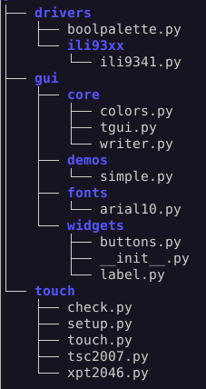

# Setting up a touch display

[Main README](./README.md)

# 1. Defining the approach

## 1.1 Choosing hardware

### 1.1.1 Screen

Touch screens vary considerably in quality. Manufacturers such as Adafruit make
good quality displays: a sustained touch at a fixed location produces readings
with a high level of consistency. Further, they produce consistent results over
the entire surface with no dead zones. Chinese units can be cheap but produce
noisy outputs. [This Adafruit screen](https://www.adafruit.com/product/1743) was
used in development with [this touch controller](http://www.adafruit.com/products/5423)
with good results.

The [supported displays](https://github.com/peterhinch/micropython-nano-gui/blob/master/DISPLAYS.md)
doc lists display controllers having compatible drivers.

### 1.1.2 Resistive or Capacitive

There is a perception that capacitive touch is "better" than resistive. This is
because capacitive overlays can respond to multi-touch gestures. In the context
of this GUI that is irrelevant. For most widgets and screen layouts on small
screens, precision is the main requirement. Capacitive touch panels don't work
with a fingernail or plain plastic stylus: they must be touched with a finger or
a stylus designed for capacitive screens.

With a finger (on capacitive or resistive overlays) it is hard to touch a
precise location. For finger touch, screen layouts should be designed
accordingly, with relatively large widgets. A suitable stylus can yield
precise coordinates enabling more complex layouts. Most of the demos have such
layouts and are hard to use with finger touch.

See [touchpad doc](./TOUCHPAD.md) for supported touch controllers.

### 1.1.3 Platform

The principal issue is RAM. The amount required by an application depends on a
number of factors including display pixel count and color depth; also the
complexity and number of application screens. There is great scope for reducing
RAM requirements by using frozen bytecode (or
[romfs](https://github.com/micropython/micropython/pull/8381) when it arrives).
Fonts in particular use almost zero RAM when located in Flash. As a general
pointer the Pico runs all demos with no use of frozen code and plenty of free
RAM. On the Pico W, free RAM on the more complex demos is limited.

## 1.2 Development approach

It is suggested that the official
[mpremote](https://docs.micropython.org/en/latest/reference/mpremote.html) is
used. This can be employed in a way that avoids installing anything on the
target with the advantage that the entire GUI with all device drivers is
available at the outset.

The repository is cloned to the PC. The hardware definition file in the root of
the repo tree is edited to match the user hardware. The application is put in
the same directory and run from there. The application is deployed to the
hardware relatively late in its development, accompanied by that subset of the
GUI repo required for its operation. See [deployment](./SETUP.md#3-deployment).

An alternative is the traditional approach of deploying at the outset. This may
make sense on platforms where the USB interface is slow. Loading times are
reduced when files are in Flash rather than on the PC.

# 2. Quick start

Setup comprises the following steps:
1. Cloning the repo.
2. Writing a `touch_setup.py` file. This defines the display interface. It
imports the correct device driver for the display, then defines `Pin` objects
for the display's control signals and defines a hardware SPI bus for the screen.
The display driver constructor creates a global `ssd` instance. Constructor args
assign the interface elements and define the orientation of the screen
(portrait, landscape, upside-down (USD) which should be chosen to match project
requirements.
3. Testing and confirming orientation by running a simple script.
4. Modifying `touch_setup.py` to add a touchscreen definition. Typically this
is an I2C or SPI interface, in some cases with additional `Pin` objects. The
interface may be hard or soft as speeds are relatively low.
5. Calibrating the touchscreen. This involves running a script, touching objects
on screen, and pasting a line of code into `touch_setup.py`.
6. Confirming operation using one or more of the supplied demo scripts.

The following describes those steps in detail. Assumptions are that `mpremote`
is used to mount the PC directory and that hardware consists of a Pico with
ILI9341 display and TSC2007 touch controller.

## 2.1 Clone the repo

Choose a working directory on the PC and issue:
```bash
$ git clone https://github.com/peterhinch/micropython-touch/
```
Change to the `micropython-touch` directory.

## 2.2 Edit touch_setup.py

See examples in the `setup_examples` directory.

Edit this file to match your hardware. Initially the aim is to configure the
display, so there is no reference to the touch panel. Typical contents are as
follows:
```python
from machine import Pin, SoftI2C, SPI, freq
import gc
from drivers.ili93xx.ili9341 import ILI9341 as SSD

freq(250_000_000)  # RP2 overclock
# Create and export an SSD instance
prst = Pin(8, Pin.OUT, value=1)
pdc = Pin(9, Pin.OUT, value=0)  # Arbitrary pins
pcs = Pin(10, Pin.OUT, value=1)
spi = SPI(0, sck=Pin(6), mosi=Pin(7), miso=Pin(4), baudrate=30_000_000)
gc.collect()  # Precaution before instantiating framebuf
ssd = SSD(spi, pcs, pdc, prst, height=240, width=320, usd=True)

from gui.core.tgui import Display, quiet
quiet()  # Suppress free RAM messages (optional)
display = Display(ssd)
```
The `Pin` instances are arbitrary, but the SPI instance should be hard SPI with
the maximum baudrate permitted by the display driver chip. The bus should not be
shared with any other device if this is possible. However some displays such as
the Waveshare Pico Res Touch units share the bus between the touh controller and
the screen. Please see [Section 2.7](./SETUP.md#27-shared-spi-bus) for details
of the changes to `touch_setup.py` needed to accommodate bus sharing.

Args to `SSD` should be chosen to match the display dimensions in pixels and the
required orientation (landcsape/portrait etc.) Options depend on the specific
display driver. See the
[display drivers doc.](https://github.com/peterhinch/micropython-nano-gui/blob/master/DRIVERS.md).

## 2.3 Test the display

Run `mpremote` as follows:
```bash
$ mpremote mount .
```
At the REPL paste the following (ctrl-e, ctrl-v, ctrl-d):
```python
from touch_setup import ssd  # Create a display instance
from gui.core.colors import *
ssd.fill(0)
ssd.line(0, 0, ssd.width - 1, ssd.height - 1, GREEN)  # Green diagonal corner-to-corner
ssd.rect(0, 0, 15, 15, RED)  # Red square at top left
ssd.rect(ssd.width -15, ssd.height -15, 15, 15, BLUE)  # Blue square at bottom right
ssd.show()
```
With the display oriented as per the project requirements, it should show a red
square at the top left, a blue square at bottom right, and a green diagonal line
passing through the squares. This should be pixel perfect.

#### Round displays

The above script is not very useful on round displays as the rectangles are off
screen. The following should be used:
```python
from touch_setup import ssd  # Create a display instance
from gui.core.colors import *
ssd.fill(0)
w = ssd.width
ssd.line(0, 0, w - 1, w - 1, GREEN)  # Green diagonal corner-to-corner
offs = round(0.29289 * w / 2)
ssd.rect(offs, offs, 15, 15, RED)  # Red square at top left
ssd.rect(w - offs - 15, w - offs - 15, 15, 15, BLUE)  # Blue square at bottom right
ssd.ellipse(119, 119, 119, 119, GREEN)
ssd.show()
```

## 2.4 Add the touch overlay

Exit the REPL with `ctrl-x`. Edit `touch_setup.py` to add the touch
controller. In the case of TSC2007 replace the last line
(`display = Display(ssd)`) with the following (pin numbers may be adapted):
```python
from touch.tsc2007 import TSC2007
i2c = SoftI2C(scl=Pin(27), sda=Pin(26), freq=100_000)
tpad = TSC2007(i2c, ssd)
display = Display(ssd, tpad)
```
See [touchpad doc](./TOUCHPAD.md) for other touch controllers.

Hard or soft I2C may be used. Note that I2C interfaces require pullup resistors.
In many cases these are installed on the target hardware.

Touch controllers such as XPT2046 use an SPI bus. This may be hard or soft and
speed is not critical. If the SPI bus is shared with that of the display, please
see [Section 2.7](./SETUP.md#27-shared-spi-bus).

## 2.5 Touch calibration

Run `mpremote mount .` as before. At the REPL issue
```python
>>> import touch.setup
```
The script displays a cross at the top left of the screen. Touch it firmly with
a stylus. Repeat for the following three crosses as they appear. The script will
issue a line of code like
```python
tpad.init(240, 320, 120, 314, 3923, 3878, True, True, False)
```
It is suggested that calibration be repeated a few times as touch hardware can
be inconsistent. The last four numeric args should be studied: there should be
two fairly low values followed by two similar large ones. Once a fairly
consistent response has been achieved, the line of code should be pasted into
`touch_setup.py` as below:
```python
from touch.tsc2007 import TSC2007
i2c = SoftI2C(scl=Pin(27), sda=Pin(26), freq=100_000)
tpad = TSC2007(i2c, ssd)
tpad.init(240, 320, 120, 314, 3923, 3878, True, True, False)  # Extra line
display = Display(ssd, tpad)
```

After a reboot the touch interface should work. A script `touch.check` provides
optional confirmation. At the REPL issue:
```python
>>> import touch.check
```
and touch various points on the screen with a stylus. Reported `row` and `col`
coordinates should be near zero at the top left, increasing to close to the
display's pixel dimensions as touch is moved from downwards and to the right.

## 2.6 Final confirmation

At the REPL reset the hardware (with `ctrl-d`) and issue:
```python
>>> import gui.demos.simple
```
This should show two `Button` widgets labelled "Yes" and "No". When they are
touched, output should appear at the REPL.

## 2.7 Shared SPI bus

Certain displays such as the
[Waveshare Pico res touch](https://www.waveshare.com/wiki/Pico-ResTouch-LCD-2.8)
share the SPI bus between the display and the touch controller. The following
changes to standard setup must be made to accommodate this (an example file
is `st7789_ws_pico_res_touch_pico.py` in `setup_examples`).
1. The SPI baudrate should be set to 2.5MHz to enable `touch.setup` and
`touch.check` to run.
2. An additional arg must be passed to the `Display` constructor. This is a
3-tuple comprising the SPI bus instance, the display baudrate (typically 33MHz),
and the touch controller baudrate (typically 2.5MHz).

## 2.8 Troubleshooting

If a screen proves hard to calibrate it can be informative to run `touch.check`
on the uncalibrated screen. Comment out any `tpad.init` line in
`touch_setup.py`, reboot and run the test. Ignore the `row` and `col` values.
The `x` and `y` values should vary smoothly as a touch is moved across the
display. Values should start around 0 to the low hundreds and end within a few
hundred of 4095. If there are dead zones where the value of an axis barely
changes as the touch is moved, the touch overlay is not usable.

If calibration appeared successful yet the demos don't respond correctly to
touch there may be an issue with `touch.setup.py`. Please run `touch.check` and
study the `row` and `col` values. With the display oriented so that the text is
correctly displayed, the values should be near 0 with a touch near the top left
hand corner. As touch moves downwards, `row` should increase. Moving to the
right, `col` should increase. If this does not occur, the three boolean values
in this `touch_setup.py` line may need to be amended.
```python
tpad.init(240, 320, 120, 314, 3923, 3878, True, True, False)
```
Their meanings are as follows:
* `trans:bool` Transpose axes.
* `rr:bool` Reflect rows.
* `rc:bool` Reflect columns.

Please report any problems with `touch.setup.py`.

### 2.7.1 Dead zones

These can occur where `touch.check` shows a band near one edge where `row` or
`col` is stuck; this despite `x` and `y` values which show no dead zone. The
cause is incorrect calibration. Note that if `x` or `y` also show a dead zone
the cause is almost certainly poor quality touch overlay hardware.

To understand dead zones it is worth understanding the meaning of the numeric
args to `tpad.init`:
1. `xpix: int` Number of pixels associated with `x` coordinate.
2. `ypix: int` Number of pixels associated with `y` coordinate.
3. `xmin: int` Minimum value of `x`.
4. `ymin: int` Minimum value of `y`.
5. `xmax: int` Maximum  value of `x`.
6. `ymax: int` Maximum value of `y`.

If the actual range of `x` or `y` values is not approximately equal to the
range specified, a dead zone will occur close to a display edge. Remove the
`tpad.init` line from `touch_setup.py`, reboot and repeat calibration.

# 3. Deployment

This is for two scenarios:
* A completed application is to be deployed to the hardware.
* The developer has opted to locate files on the hardware rather than mounting
the PC directory with `mpremote`.

Two approaches are possible. One is simply to copy everything: this occupies
about 950KB of Flash space. The other is to copy a subset to match actual usage.

## 3.1 Copying everything

In the root directory of the clone issue:
```bash
$ mpremote cp -r touch :
$ mpremote cp -r gui :
$ mpremote cp -r drivers :
$ mpremote cp touch_setup.py :
$ mpremote cp uQR.py :
```

## 3.2 Minimal deployment

Move to the `micropython-touch` directory on the PC. Issue
```bash
$ mpremote mip install "github:peterhinch/micropython-touch"
```
This installs a minimal subset of the GUI to the hardware, enabling all the
steps described above to be accomplished. The filesystem on the device will be
similar to this (under the `/lib` directory):  
  

Note that the display driver for ILI9341 is installed. If a different driver is
required, see
[the drivers doc](https://github.com/peterhinch/micropython-nano-gui/blob/master/DRIVERS.md#12-installation).

To setup a system with files on the device follow the above instructions,
ensuring that after each edit of `touch_setup.py` the file is copied to the
device:
```bash
$ mpremote cp touch_setup.py :
```
Where a completed application is to be deployed it is necessary to copy all
fonts, widgets and bitmaps employed by the application.

## 3.1 Freezing bytecode

Substantial RAM savings may be achieved using this technique. Please see
[Appendix 2 Freezing bytecode](./README.md#appendix-2-freezing-bytecode) in the
main README.
